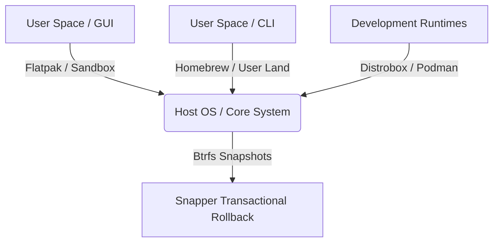
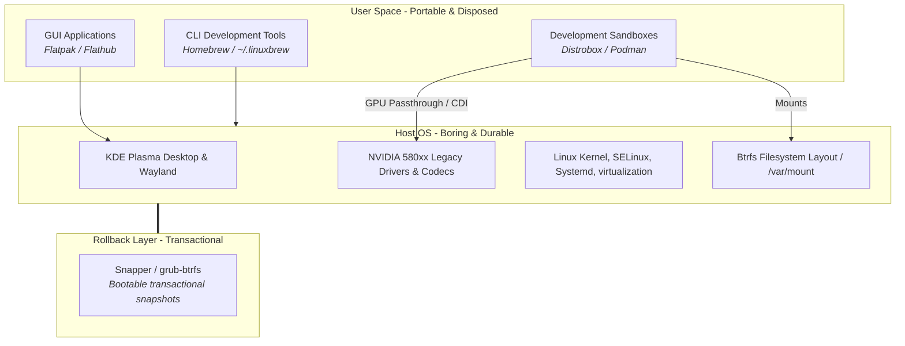

From the beginning of my career, I have been interested in isolating development environments for reproducibility, portability, and rapid recovery. In the past, I was thinking, docker is the best tool for this purpose. So, I tried to use docker for my development environment. I created a github repository, and pushed my dockerfiles to it. I also added github actions to build and push images to docker hub. At the beginning, I just run an ssh server in my development docker containers and treat them like a remote server, then ssh into docker image, rsync my source code, and run/debug with an IDE. Later, I found out devcontainer is much better for this purpose and I replaced my worklfow to use devcontainers (actually i just removed the ssh server from my docker images).

At some point, I watched a [Youtube video](https://www.youtube.com/watch?v=bf1xqjLeA9M) about `bootc` and I was very inspired by it, started reading about it more and more. And, then later, I found myself reading [`ostree`](https://ostreedev.github.io/ostree/introduction/). All these learnings and readings lead me to using immutable OS. I tried Fedora Kinoite, and Universal Blue Aurora for a while. And I have to say, I really love the experience. But, there was some shortcomings that I couldn't overcome yet. Before the release of Fedora 44, I planned to design my own atomic/immutable-like OS. I, first, wrote my goal, my architecture and then my requirements, applications that I used everyday, my habits/preferences/workflows, and etc. Then I tried to organize setup/instalation setups in a `Makefile`, and series of bash scripts. You can see [my repo here](https://github.com/blgnksy/fedora-immutable-like-os). But, the rest of this post explains the core idea, architecture, goal, and some choices. You can adapt it to your needs as well. 

> Unlike NixOS, this setup does not attempt full declarative system management. The goal is operational stability with minimal workflow disruption, not total system reproducibility. But, the declarative apporoach of NixOs was very inspiring.

---

> **The Architectural Philosophy:** Keep the foundation boring, stable, and highly secure. Elevate application runtimes, developer environments, and CLI suites to isolated, user-space layers. Drive everything through deterministic, version-controlled configuration.

## The Goal

To establish a highly optimized, high-performance developer workstation using **Fedora KDE Plasma Desktop** and an **NVIDIA GPU** that behaves as close to a modern atomic/immutable operating system as possible. 

This is achieved by implementing four core architectural pillars:


---

1. **Zero Host Drift:** Minimize ongoing host modification. After the initial boot and setup wave, `dnf` on the host is locked down. The host OS acts strictly as an unpolluted, bare-metal hardware abstraction layer (kernel, legacy drivers, container engines).
2. **Layered Responsibility:** Enforce a strict decoupling of roles. Universal CLI utilities live in **Homebrew**, desktop applications live in **Flatpak**, and mutable developer runtimes run isolated inside **Distrobox**.
3. **Frictionless Legacy Hardware Integration:** Secure maximum performance and reliability from legacy NVIDIA cards (580xx branch) without encountering the compilation issues and layout friction typical of ostree-based systems.
4. **Deterministic Reproducibility:** Ensure the complete desktop environment, tool suite, and configuration can be rebuilt programmatically in minutes from a single configuration using `chezmoi` dotfiles, `Brewfile` manifests, and container definitions.

> This setup is not cryptographically immutable and does not enforce a read-only root filesystem.
> 
> Instead, it relies on:
> - minimized host package installation
> - transactional Btrfs snapshots
> - reproducible declarative setup
> - containerized development environments
> - restricted host package workflows
> - user-level operational discipline

---

>Homebrew is not used because it is “better” than DNF.
>
> It is used because:
> - it is fully user-space scoped
> - it keeps personal CLI tooling independent from the host OS lifecycle
> - the same Brewfile works across Linux and macOS
> - uninstalling the workstation does not affect the toolchain layer
> - it reduces host package drift significantly

---

## The Mental Model

This system is built as a **snapshot-backed minimal host**, offering a robust alternative to fully immutable operating systems (such as Fedora Silverblue or Kinoite). Instead of enforcing a read-only filesystem via hardware or kernel blocks, I establish a **disciplined layer separation** reinforced by tooling and user habit.

### System Architecture



### Layer Lifecycle & Management

| Layer | Target Runtimes | State Style | Managed By | Path Context |
| :--- | :--- | :--- | :--- | :--- |
| **GUI Apps** | Browsers, Communication, Productivity | Sandboxed / Stateful | `flatpak` | `~/.var/app/` |
| **CLI Tools** | Editor (Neovim), Terminal Multiplexer, Shell Utils | User-owned / Stateful | `brew` | `/home/linuxbrew/` |
| **Dev Environments** | Compilers (GCC/Clang), Runtimes (Node/Python), SDKs | Ephemeral / Disposable | `distrobox` | Isolated containers / Shared `$HOME` |
| **Base Host** | Display, Network, Hardware virtualization, Security | Locked / Minimal | Automated / `dnf-host` | `/`, `/usr`, `/etc` |

---

## Why This Approach?

Traditional Linux workstation setups inevitably suffer from **Operating System Decay**. Over months and years, conflicting global libraries, orphaned development packages, drifting systemd services, and mismatched interpreter versions (Python, Node) slowly degrade system stability and make disaster recovery nearly impossible.

This setup resolves OS decay by enforcing a hybrid, layered model that offers the reliability of an immutable operating system with the uncompromised flexibility of standard Fedora Workstation.

This creates a practical middle ground between a traditional mutable Linux installation and a fully immutable operating system:

| Traditional distro | This setup | Fully immutable distro |
|---|---|---|
| Everything installed on host | Host minimized intentionally | Host almost completely locked |
| Easy to modify, easy to break | Controlled modification model | Very resistant to accidental breakage |
| Package sprawl over time | Clear separation of responsibilities | Strong separation enforced by design |
| Rollback is manual | Snapper snapshots + rollback | Atomic image rollback |
| Very flexible | Flexible where it matters | More opinionated workflow |

For a personal workstation, this balance is often more comfortable than a strict immutable workflow because it preserves flexibility without giving up reproducibility and rollback safety.


### Why not Silverblue or Kinoite?

While genuine atomic systems are excellent, they present significant friction for active developer machines, particularly those relying on older hardware:

*   **The Legacy NVIDIA Bottleneck:** Atomic systems layer the NVIDIA driver on top of the base system image via `rpm-ostree`. While this works well for modern GPUs supported by the latest driver, Pascal and Turing cards requiring the legacy 580xx branch face high friction. Kernel upgrades often outpace legacy driver repository updates, causing silent build failures, broken boot states, or complex manual overrides. Staying on Workstation allows standard `akmod` to safely compile drivers locally at the time of update, completely controlled by local snapshots.
*   **Granular Workstation Rollbacks:** Immutability's primary asset is atomic OS-level rollback. However, on a single personal workstation, **Snapper on Btrfs** provides *per-transaction* rollback. If a system update or configuration change breaks your desktop, you can boot into a pre-update snapshot from the GRUB menu or undo the exact DNF transaction with a single command. You gain 100% of the safety with none of the read-only filesystem restrictions.
*   **Host Level Debugging & Virtualization:** Developers occasionally need to run low-level profilers (`perf`), system-call tracers (`strace`), system virtualization (`QEMU/KVM`), or kernel-header dependent debuggers. Layering these deep dependencies on `rpm-ostree` requires frequent host rebases and compromises the core value of the immutable image. A minimal, snapshot-protected host handles these tools natively with zero friction.

### Why Fedora KDE Workstation?

- **Current packages.** Fedora ships recent kernel, systemd, and Mesa versions — important for GPU driver compatibility and modern container tooling (Podman, CDI, Netavark).
- **Btrfs by default.** Anaconda creates Btrfs with `root` and `home` subvolumes out of the box, giving you Snapper-compatible layout with no manual partitioning work.
- **DNF5 + RPM Fusion.** DNF5 (Fedora 41+) is significantly faster than DNF4. Combined with RPM Fusion's broad package set, the host package story is solid for a one-time-setup model.
- **SELinux enforcing by default.** Strong security posture without sacrificing usability.
- **KDE Plasma** is highly configurable, resource-efficient, and works well with NVIDIA on both X11 and Wayland(my choice). Compared to GNOME, it requires no extensions to be fully functional.
- **Immutable-first tooling is well-tested here.** Because Fedora is home to Silverblue/Kinoite, tools like Distrobox, Toolbox, and Flatpak are first-class citizens with excellent Fedora-specific documentation.


### Why this workflow works well on a personal machine

This setup deliberately separates responsibilities across layers instead of turning the host operating system into a general-purpose dumping ground.

The idea is simple:

- **The host OS should stay boring and predictable.**
  Fedora handles the kernel, graphics stack, firmware, filesystem, networking, virtualization, and security updates.
- **GUI applications should stay sandboxed and disposable.**
  Flatpak keeps desktop applications isolated from the base system while still integrating nicely with KDE Plasma.
- **CLI tooling should stay user-owned.**
  Homebrew avoids cluttering the host with development utilities and keeps your personal shell environment portable across Linux and macOS.
- **Development stacks should stay containerized.**
  Distrobox gives you mutable environments for compilers, SDKs, language runtimes, and experimental packages without polluting the base OS.


### Advantages of this hybrid approach

| Advantage | Detail |
|-----------|--------|
| NVIDIA legacy support | Pin exact driver versions; avoid akmod regressions on older GPUs |
| Full host flexibility | Any COPR, any RPM — the host is writable, but access is guarded |
| Real rollback | Snapper pre/post snapshots on every `dnf` transaction, bootable from GRUB |
| Clean separation | Host = kernel/drivers; Homebrew = CLI tools; Flatpak = GUI apps; Distrobox = dev environments |
| Reproducible rebuild | Brewfile + distrobox.ini + Makefile phases + `host-setup.sh` rebuild the full setup |
| Low ongoing maintenance | `make update` handles Flatpak + Brew + Distrobox; host gets security patches automatically |

### Trade-offs

| Trade-off | Detail |
|-----------|--------|
| Not truly immutable | The root filesystem is writable; the `dnf` guard enforces discipline, not hardware |
| Two package managers | Homebrew and DNF can have conflicting library versions — keep dev work inside Distrobox |
| Homebrew glibc footprint | Homebrew on Linux ships its own glibc (~200 MB); expected, but worth knowing |
| Phase 7 requires upfront work | chezmoi + dotfiles are powerful but take time to set up correctly |

---

**Setup waves:**

| Wave | Phase | What |
|------|-------|------|
| A — Host (once) | 1–2 | NVIDIA, Snapper, SSH, Podman/CDI, codecs, virt, crypto |
| B — User CLI | 3 | Development Tools → Homebrew → zsh → Brewfile (incl. Distrobox) |
| C — Apps & dev | 4–5 | Flatpak GUIs, Distrobox containers, exports |
| D — Lockdown | 6–7 | dnf guard, automatic security updates, dotfiles |

Until Phase 6, use plain `sudo dnf` for host installs. After Phase 6, use `sudo dnf-host` (the guard blocks bare `dnf`).

### Makefile automation (`~/setup/Makefile`)

Most setup and day-2 steps are available as **`make` targets** in `~/setup/`. Raw commands below are kept for reference; where automation exists, a **Make** line is shown.

> **Day-2 automation:** `make update` (Flatpak + Brew + Distrobox) can be added to a cron job or a systemd user timer for fully hands-off updates. Host security patches are already automated via `dnf5-automatic` (Phase 6). Brew and Flatpak don't auto-update by design — `make update` is the deliberate trigger.

```bash
make help-setup   # one-time setup targets (phases 0–7)
make help         # day-2 maintenance (update, health, snapper, …)
make <target>     # from any directory

# Optional shell alias (~/.zshrc):
# alias ws='make -C ~/setup'
```

| Phase | Aggregate target | Verify (after phase) |
|-------|------------------|----------------------|
| 0 | — | `make phase0-verify` |
| 1 | `make phase1-all` | `phase1-verify` (auto); after reboot: `phase1-verify-gpu` |
| 2 | `make phase2-all` | `phase2-verify` (auto) |
| 3 | `make phase3-brew-deps` … | `phase3-verify` (mostly **WARN** — brew/shell are manual) |
| 4 | `make phase4-flatpak-apps` … | `phase4-verify` |
| 5 | `make phase5-distrobox-dev` … | `phase5-verify` |
| 6 | `make phase6-dnf-automatic` … | `phase6-verify` |
| All | — | `make verify-all` |
| Day-2 | `make update` `health` | No host `dnf` |

**Notes:** `phase1-all` and `phase2-all` run their verify step automatically. Failures exit non-zero; **WARN** lines are advisory (optional packages, post-reboot checks, manual steps). Phase 1 host wave still needs `phase1-upgrade` + **reboot** before `phase1-verify-gpu`. Run `make … phaseN-verify` **without sudo** (root breaks Homebrew and `~/.local` checks; if you used `sudo make`, verify re-runs as your user automatically).

Layout: `~/setup/Makefile`, `~/setup/scripts/*.sh`, this guide at `~/setup/fedora-kde-immutable-like-setup.md`. Skipped steps (ISO install, `ssh-copy-id`, interactive installers) have no target — see `make help-setup`.

---

## Phase 0: Installation

> **Make:** `make phase0-verify` (after install)

- [ ] Download **Fedora KDE Spin 44** ISO
- [ ] Boot installer and choose **Custom Partitioning**
- [ ] Use **Btrfs** as the filesystem (this is the default on Fedora, but verify)
- [ ] Suggested partition layout:
  - `/boot/efi` — 512 MB, FAT32
  - `/boot` — 1 GB, ext4
  - `/` — Btrfs (rest of disk)
- [ ] Fedora creates subvolumes automatically: `root`, `home`, `var`
- [ ] After install, verify Btrfs layout (optional):
  ```bash
  findmnt -no FSTYPE,SUBVOLNAME /
  sudo btrfs subvolume list /
  ```
- [ ] Plan **`/var/mount`** layout: all extra disks mount at **`/var/mount/<Name>`** (e.g. `Projects`, `Backup`, `Workspace`) — not `/mnt` or `$HOME`. See [Appendix C](#appendix-c-etcfstab-and-varmount).

  > **Removable media note:** KDE Plasma auto-mounts removable USB drives under `/run/media/$USER/<label>` via Solid — this is not configurable without patching udev rules, and isn't worth fighting. The `/var/mount` convention is for **permanent extra disks** listed in `/etc/fstab`. Leave USB auto-mount behaviour as-is.
- [ ] Complete installation and reboot

---

## Phase 1: NVIDIA 580xx Legacy Driver (Host — the only big `dnf` step)

> **Make:** `make phase1-all` — or step-by-step: `phase1-dnf-tweaks`, `phase1-ssh`, … (`help-setup`). After install: `phase1-verify`; after reboot: `phase1-verify-gpu` (or `make gpu-test`).

This is the one area where you must touch the host system with `dnf`. Get it done first.

### DNF Speed Tweaks (Do This First)

> **Make:** `make phase1-dnf-tweaks`

Fedora's defaults are conservative. Two small config changes make every subsequent `dnf` command significantly faster — apply these *before* the first `dnf upgrade` so the rest of the setup benefits.

- [ ] Enable parallel downloads and fastest-mirror selection:
  ```bash
  sudo dnf config-manager setopt max_parallel_downloads=10
  sudo dnf config-manager setopt fastestmirror=True
  ```
  
  Alternatively, edit `/etc/dnf/dnf.conf` directly and add:
  ```ini
  [main]
  max_parallel_downloads=10
  fastestmirror=True
  defaultyes=True       # Y is default for prompts
  keepcache=True        # Don't delete downloaded packages immediately
  # Fedora 44: if HTTPS to repos fails, set CA bundle explicitly (see Appendix A)
  sslcacert=/etc/pki/ca-trust/extracted/pem/tls-ca-bundle.pem
  ```

- [ ] Verify the settings took effect:
  ```bash
  dnf --dump-main-config | grep -E '^(fastestmirror|max_parallel_downloads) = '
  ```

A few caveats from the field:
- `max_parallel_downloads=10` is the sweet spot on most connections. Higher (15–20) helps on very fast networks; lower (3–5) on flaky ones.
- `fastestmirror=True` adds a few seconds to the *first* run as it probes mirrors, then makes subsequent runs noticeably faster. If your network is unstable and probing takes longer than it saves, unset with `sudo dnf config-manager unsetopt fastestmirror`.
- `defaultyes=True` is convenient but means `dnf install foo` won't prompt — pair this with the **dnf guard** trick from Phase 6 so you don't auto-confirm a typo on the host.

- [ ] Update the system:
  ```bash
  sudo dnf upgrade --refresh -y
  sudo reboot
  ```
  > **Make:** `make phase1-upgrade` (reboot manually)

### SSH Server (Early Setup)

> **Make:** `make phase1-ssh` · optional: `make phase1-fail2ban`

Get SSH running first so you can manage the machine remotely while doing the rest of the setup — useful for remote access from a laptop, VS Code Remote-SSH, or as a jump host to other machines on your network.

- [ ] Verify openssh-server is installed (usually shipped with Fedora):
  ```bash
  rpm -q openssh-server || sudo dnf install -y openssh-server
  ```

- [ ] Enable and start the sshd service:
  ```bash
  sudo systemctl enable --now sshd
  ```

- [ ] Open SSH port in firewalld:
  ```bash
  sudo firewall-cmd --permanent --add-service=ssh
  sudo firewall-cmd --reload
  ```

- [ ] Generate an SSH key for this machine if you don't have one:
  ```bash
  ssh-keygen -t ed25519 -C "$(whoami)@$(hostname)"
  ```

- [ ] Add your public key from another machine (so you can log in without a password):
  ```bash
  # From your other machine:
  ssh-copy-id your-user@this-host
  
  # Or manually: append your laptop's ~/.ssh/id_ed25519.pub to
  # ~/.ssh/authorized_keys on this host, then:
  chmod 700 ~/.ssh
  chmod 600 ~/.ssh/authorized_keys
  ```

- [ ] **Harden the SSH config.** Use a drop-in file in `/etc/ssh/sshd_config.d/` to keep the main config clean and survive future package updates:
  ```bash
  sudo tee /etc/ssh/sshd_config.d/00-hardening.conf > /dev/null << 'EOF'
  # No root login
  PermitRootLogin no
  
  # Key-based auth only — VERIFY KEY-BASED LOGIN WORKS BEFORE APPLYING THIS
  PasswordAuthentication no
  KbdInteractiveAuthentication no
  PubkeyAuthentication yes
  
  # Sensible session limits
  MaxAuthTries 3
  ClientAliveInterval 300
  ClientAliveCountMax 2
  
  # (Optional) restrict to specific users
  # AllowUsers your-username
  EOF
  
  # Syntax check BEFORE restart — catches typos that would otherwise lock you out
  sudo sshd -t && sudo systemctl restart sshd
  ```
  
  The `sshd -t` validates the full merged config (main file + all drop-ins) and exits non-zero on any error. If it fails, fix the file and re-run — your existing SSH session stays alive while you fix it.
  
  ⚠️ **Before disabling password auth, open a second SSH session and verify your key works.** If something's misconfigured, your existing session stays alive while you fix it — saving you from getting locked out.

- [ ] (Optional) **Install fail2ban** to block brute-force attempts. On Fedora, fail2ban ships with **zero active jails** — installing the package alone does nothing. You have to enable the sshd jail explicitly:
  ```bash
  sudo dnf install -y fail2ban fail2ban-firewalld
  ```

- [ ] Create a drop-in jail config for sshd:

  > **chezmoi note:** This file lives in `/etc/fail2ban/` — chezmoi only manages `$HOME`. The `make phase1-fail2ban` target re-creates it idempotently; that's the right place to track it.
  ```bash
  sudo tee /etc/fail2ban/jail.d/sshd.local > /dev/null << 'EOF'
  [sshd]
  enabled = true
  backend = systemd
  port    = ssh
  maxretry = 5
  findtime = 10m
  bantime = 1h
  EOF
  ```
  
  Why these settings:
  - `enabled = true` — without this line, the jail exists but doesn't run. This is the part most guides miss.
  - `backend = systemd` — Fedora logs SSH attempts to the journal, not `/var/log/secure`. Without this, fail2ban silently fails to find anything to scan.
  - `port = ssh` — uses the symbolic name; if you changed to port 2222, change this to `port = 2222`.
  - `maxretry = 5` over `findtime = 10m`, ban for `bantime = 1h` — sensible defaults; tune to taste.

- [ ] Start fail2ban and verify the jail is active:
  ```bash
  sudo systemctl enable --now fail2ban
  sudo fail2ban-client status                  # Should list 'sshd' under Jail list
  sudo fail2ban-client status sshd             # Detailed status (currently failed, banned, etc.)
  ```
  
  If `fail2ban-client status` shows no jails, check `journalctl -u fail2ban` for errors — common causes are `backend = auto` defaulting to a non-existent log file, or the `[sshd]` jail conflicting with a separately-named definition.

- [ ] (Optional) Set the default action globally to use firewalld instead of iptables (the `fail2ban-firewalld` package installs `/etc/fail2ban/jail.d/00-firewalld.conf` which already does this — verify with):
  ```bash
  cat /etc/fail2ban/jail.d/00-firewalld.conf
  # Should show: banaction = firewallcmd-rich-rules[actiontype=<multiport>]
  ```

- [ ] (Optional) **Change SSH port** from 22 to reduce log noise from scanners:
  ```bash
  # Edit /etc/ssh/sshd_config.d/00-hardening.conf, add:
  # Port 2222
  
  # Update firewalld:
  sudo firewall-cmd --permanent --add-port=2222/tcp
  sudo firewall-cmd --permanent --remove-service=ssh
  sudo firewall-cmd --reload
  
  # Update SELinux to allow the new port:
  sudo semanage port -a -t ssh_port_t -p tcp 2222
  
  sudo sshd -t && sudo systemctl restart sshd
  ```
  Note: if you change the port, remember to update your `~/.ssh/config` on client machines, and update `fail2ban` config accordingly.

- [ ] Test from another machine:
  ```bash
  ssh your-user@this-host         # or with -p 2222 if you changed the port
  ```

- [ ] (Optional) Add a client-side `~/.ssh/config` entry on your laptop:
  ```
  Host workstation
      HostName <your-fedora-machine-ip-or-hostname>
      User your-username
      Port 22
      IdentityFile ~/.ssh/id_ed25519
      ForwardAgent yes      # useful for git push from the workstation using your client computer keys
  ```

### Debugging Tools (Host)

> **Make:** `make phase1-debug` · `make phase1-perf`

System debuggers and profilers need kernel-level access (perf counters, ptrace, kprobes), so they go on the host — not in a sandbox. These complement your existing GDB infrastructure.

- [ ] Install the core debugging stack:
  ```bash
  sudo dnf install -y \
    gdb \
    gdbserver \
    strace \
    ltrace \
    perf \
    valgrind \
    binutils \
    elfutils
  ```

**What each tool does:**
- **gdb** — interactive debugger; pair with a `~/.gdbinit` for pretty-printers and project-specific helpers
- **gdbserver** — runs on the host to accept remote debugger connections (e.g., from VS Code on a laptop), or attach from a local gdb client to a `gdbserver` on a remote machine
- **strace** / **ltrace** — system-call and library-call tracing; essential for diagnosing hangs, unexpected file access, or missing shared libraries
- **perf** — Linux perf events: CPU profiling, cache miss analysis, scheduler latency. Needs host-level access, which is why it can't live in a container
- **valgrind** — memory error detector; catches uninitialized reads, use-after-free, and heap leaks

- [ ] (Optional) Cross-architecture debugging (e.g., aarch64) — install `gdb-multiarch` via a Distrobox with a Debian/Ubuntu base image, which packages it directly. Fedora doesn't ship `gdb-multiarch`; building it from source on the host is not worth the effort when a one-line `distrobox create` gives you a clean cross-capable gdb.

- [ ] Allow `perf` to access hardware counters without root (set kernel param at boot):
  ```bash
  echo "kernel.perf_event_paranoid = 1" | sudo tee /etc/sysctl.d/99-perf.conf
  sudo sysctl --system
  ```

---

> **Make:** `make phase1-rpmfusion` · `make phase1-nvidia` · `make phase1-nvidia-suspend` · `make phase1-nvidia-toolkit` · `make phase1-podman` · `make phase1-cdi` · `make phase1-refresh-cdi-script`

- [ ] Enable RPM Fusion repos:
  ```bash
  sudo dnf install -y \
    https://mirrors.rpmfusion.org/free/fedora/rpmfusion-free-release-$(rpm -E %fedora).noarch.rpm \
    https://mirrors.rpmfusion.org/nonfree/fedora/rpmfusion-nonfree-release-$(rpm -E %fedora).noarch.rpm
  ```

- [ ] **Check which driver branch is available** for your GPU:
  ```bash
  dnf search akmod-nvidia | grep '^akmod-nvidia'
  # Current packages: akmod-nvidia (latest), akmod-nvidia-580xx (legacy Pascal/Turing)
  # Use the latest branch (akmod-nvidia) for GTX 16xx / RTX 20xx and newer.
  # Use akmod-nvidia-580xx for GTX 10xx (Pascal) and GTX 9xx (Maxwell).
  ```

- [ ] Install the **580xx legacy driver** (for Pascal GPUs — GTX 10xx series):
  ```bash
  sudo dnf install -y \
    akmod-nvidia-580xx \
    xorg-x11-drv-nvidia-580xx \
    xorg-x11-drv-nvidia-580xx-cuda \
    xorg-x11-drv-nvidia-580xx-cuda-libs \
    xorg-x11-drv-nvidia-580xx-libs
  ```

- [ ] Blacklist Nouveau:
  ```bash
  echo "blacklist nouveau" | sudo tee /etc/modprobe.d/blacklist-nouveau.conf
  sudo dracut --force
  ```

  `dracut --force` rebuilds the **initramfs** (initial RAM disk) — the small filesystem the kernel boots from before the real root is mounted. The Nouveau blacklist and the new NVIDIA kernel module are baked into the initramfs here. Without this step, the kernel would ignore the blacklist on next boot and Nouveau would load before the NVIDIA driver, causing a conflict.

- [ ] Reboot and verify:
  ```bash
  sudo reboot
  # After reboot:
  nvidia-smi          # Should show your GPU, and selected driver version
  ```

- [ ] **Fix NVIDIA suspend/resume** (Pascal has known issues — system hangs or wakes to a black screen). NVIDIA ships systemd services that handle GPU state save/restore, but they're not enabled by default:
  ```bash
  sudo systemctl enable \
    nvidia-suspend.service \
    nvidia-hibernate.service \
    nvidia-resume.service
  ```
  
  Add the persistence kernel parameter so the driver preserves GPU VRAM across suspend:
  ```bash
  sudo tee /etc/modprobe.d/nvidia-power-management.conf > /dev/null << 'EOF'
  options nvidia NVreg_PreserveVideoMemoryAllocations=1
  options nvidia NVreg_TemporaryFilePath=/var/tmp
  EOF
  
  sudo dracut --force
  ```
  
  After reboot, test with `systemctl suspend` and verify the display comes back. If it still fails:
  - Try kernel param `nvidia-drm.modeset=1` (some setups need it, others break with it)
  - Check `journalctl -b -1 | grep -i nvidia` after a failed resume
  - As a last resort, switch to s2idle by setting `mem_sleep_default=s2idle` (slower wake but more reliable on Pascal)

- [ ] Install **nvidia-container-toolkit** for GPU passthrough to containers. On Fedora the `.repo` file ships with the GPG key URL embedded (`gpgkey=...`), so DNF fetches and imports it automatically — no manual `gpg --dearmor` step needed (that pattern is Debian-only).

  **Fedora 44 note:** If `curl` or `dnf` fails on HTTPS, ensure `sslcacert` is set in `/etc/dnf/dnf.conf` (see DNF tweaks above and [Appendix A](#appendix-a-fedora-44-gotchas)).
  ```bash
  # Add NVIDIA container repo
  curl -fsSL https://nvidia.github.io/libnvidia-container/stable/rpm/nvidia-container-toolkit.repo | \
    sudo tee /etc/yum.repos.d/nvidia-container-toolkit.repo

  # Pin version for reproducibility (check https://github.com/NVIDIA/nvidia-container-toolkit/releases for updates)
  export NVIDIA_CONTAINER_TOOLKIT_VERSION=1.19.0-1
  sudo dnf install -y \
    nvidia-container-toolkit-${NVIDIA_CONTAINER_TOOLKIT_VERSION} \
    nvidia-container-toolkit-base-${NVIDIA_CONTAINER_TOOLKIT_VERSION} \
    libnvidia-container-tools-${NVIDIA_CONTAINER_TOOLKIT_VERSION} \
    libnvidia-container1-${NVIDIA_CONTAINER_TOOLKIT_VERSION}
  ```

  On first install, DNF prompts to import the NVIDIA GPG key — answer **yes**. Verify the key was imported:
  ```bash
  rpm -q gpg-pubkey --qf '%{summary}\n' | grep -i nvidia
  ```

- [ ] **Podman** — usually preinstalled on Fedora KDE; install if missing:
  ```bash
  rpm -q podman || sudo dnf install -y podman podman-compose
  podman --version
  ```

- [ ] **Distrobox** — launcher for Phase 5 dev containers. Prefer **Homebrew** (Phase 3: `brew install distrobox` or `make phase3-brew-cli`); `make phase1-podman` falls back to `dnf` only if Brew is not installed yet (I prefer isuing `brew`):
  ```bash
  command -v distrobox >/dev/null || rpm -q distrobox || brew install distrobox || sudo dnf install -y distrobox
  distrobox --version
  ```
  Verification accepts any of: `distrobox` on `PATH`, `rpm -q distrobox`, or `brew list distrobox`.

- [ ] **Generate the CDI specification** for NVIDIA GPUs. CDI (Container Device Interface) is the modern, runtime-agnostic way to expose devices to containers — replaces the old Docker-specific `--gpus` flag:
  ```bash
  sudo mkdir -p /etc/cdi
  sudo nvidia-ctk cdi generate --output=/etc/cdi/nvidia.yaml
  ```

- [ ] Verify the CDI devices are discoverable:
  ```bash
  nvidia-ctk cdi list
  # Should show: nvidia.com/gpu=0, nvidia.com/gpu=all, etc.
  ```

- [ ] Test GPU access in Podman (rootful, simpler first test):
  ```bash
  podman run --rm --device nvidia.com/gpu=all \
    nvcr.io/nvidia/cuda:12.4.1-base-ubuntu22.04 nvidia-smi
  ```

- [ ] Test GPU access in **rootless Podman** (preferred for daily use):
  ```bash
  podman run --rm --device nvidia.com/gpu=all \
    --security-opt=label=disable \
    nvcr.io/nvidia/cuda:12.4.1-base-ubuntu22.04 nvidia-smi
  ```
  The `--security-opt=label=disable` is needed because SELinux blocks rootless access to `/dev/nvidia*` by default. If this becomes annoying, you can set it globally in `/etc/containers/containers.conf` under `[containers]`:
  ```toml
  label = false
  ```

- [ ] **Important — regenerate CDI spec after every driver update**, since the spec hardcodes library paths:
  ```bash
  sudo nvidia-ctk cdi generate --output=/etc/cdi/nvidia.yaml
  ```

- [ ] Create a `refresh-cdi` helper script (run after akmod/NVIDIA driver rebuilds):
  ```bash
  mkdir -p ~/.local/bin
  tee ~/.local/bin/refresh-cdi > /dev/null << 'EOF'
  #!/bin/bash
  set -euo pipefail
  sudo nvidia-ctk cdi generate --output=/etc/cdi/nvidia.yaml
  nvidia-ctk cdi list
  EOF
  chmod +x ~/.local/bin/refresh-cdi
  ```

  Ensure `~/.local/bin` is on your PATH (add in Phase 3 to `~/.zshrc`):
  ```bash
  echo 'export PATH="$HOME/.local/bin:$PATH"' >> ~/.bashrc   # temporary until zsh is default
  ```

- [ ] (Optional) **podman-compose** — if not installed with Podman above, either:
  ```bash
  sudo dnf install -y podman-compose          # host, one-time (Phase 1)
  # OR after Homebrew (Phase 3):
  # brew install podman-compose
  ```

### Media Codecs (RPM Fusion)

> **Make:** `make phase1-codecs` · `make phase1-vaapi` · `make phase1-flatpak-ffmpeg`

Fedora ships with limited/patent-free media support by default. Since RPM Fusion is already enabled, install the full multimedia stack now.

- [ ] Swap the limited `ffmpeg-free` for the full `ffmpeg`:
  ```bash
  sudo dnf swap ffmpeg-free ffmpeg --allowerasing
  ```

- [ ] Install the full GStreamer plugin set:
  ```bash
  sudo dnf install -y \
    gstreamer1-plugins-bad-free \
    gstreamer1-plugins-bad-free-extras \
    gstreamer1-plugins-good \
    gstreamer1-plugins-base \
    gstreamer1-plugins-ugly \
    gstreamer1-plugin-openh264 \
    gstreamer1-libav \
    gstreamer1-plugins-bad-freeworld
  ```
  
  Having the full plugin set on the host means media playback, video thumbnails, and any host-side multimedia tooling works correctly — and there are no surprises when comparing host vs container codec availability.

- [ ] (Optional) Install the **Sound and Video** group — on Fedora 44 / DNF5 the old id `sound-and-video` no longer exists. The explicit package list above is usually sufficient; use this only if you want the full group:
  ```bash
  # List available groups:
  dnf group list --available | grep -i sound
  # Typical Fedora 44 name (quotes required):
  sudo dnf group install -y "Sound and Video"
  ```

- [ ] (Optional) DVD playback:
  ```bash
  sudo dnf install -y libdvdcss
  ```

- [ ] Install **VA-API on NVIDIA** for hardware-accelerated video decode (Firefox, Chrome, mpv → NVDEC bridge):
  ```bash
  sudo dnf install -y libva-nvidia-driver libva-utils
  ```

- [ ] Verify VA-API is working with NVIDIA:
  ```bash
  vainfo
  # Should list NVDEC-backed profiles (H.264, HEVC, etc.)
  ```

- [ ] **Flatpak codecs** — most Flatpak apps ship their own runtime, but Firefox Flatpak benefits from the full ffmpeg:
  ```bash
  flatpak install flathub org.freedesktop.Platform.ffmpeg-full//24.08
  ```

- [ ] Test playback (after rebooting or restarting the browser):
  - YouTube 1080p in Firefox/Chrome — should show low CPU usage if NVDEC kicks in
  - Use `nvidia-smi dmon -s u` while playing video to see GPU decoder utilization

---

## Phase 2: Btrfs Snapshots + Rollback (Your "Atomic" Safety Net)

> **Make:** `make phase2-all` — or: `phase2-snapper`, … `phase2-grub-test`. Confirms setup: `phase2-verify` (runs automatically at end of `phase2-all`).

This gives you the same rollback capability as an atomic OS — automatic snapshots before/after every `dnf` transaction, bootable from GRUB.

- [ ] Install Snapper (in official Fedora repos):
  ```bash
  sudo dnf install -y snapper python3-dnf-plugin-snapper btrfs-assistant
  ```
  > **Make:** `make phase2-snapper` (install + `create-config` + `ALLOW_USERS`)

- [ ] Alternatively, use the automated setup script (tested on Fedora 44):
  ```bash
  git clone https://github.com/SysGuides/sysguides-snapper-fedora
  cd sysguides-snapper-fedora
  chmod +x install.sh
  ./install.sh
  ```
  The script may install **grub-btrfs** for you; if you set up Snapper manually, use the COPR steps below.

- [ ] Create Snapper config for root:
  ```bash
  sudo snapper -c root create-config /
  ```

- [ ] Allow your user to run Snapper **without sudo** (do this once right after `create-config`):
  ```bash
  sudo snapper -c root set-config ALLOW_USERS="$USER"
  sudo snapper -c root set-config SYNC_ACL=yes
  snapper list    # verify — should work without sudo
  ```
  > **Make:** included in `make phase2-snapper`

- [ ] Enable automatic pre/post snapshots for DNF transactions
  - The `python3-dnf-plugin-snapper` or the SysGuides script handles this
  - Every `dnf install/remove/upgrade` will now create a before+after snapshot pair

#### Snapper: with vs without `sudo`

After `ALLOW_USERS` + `SYNC_ACL` (above), daily use omits `sudo` and the `-c root` shortcut (`snapper` defaults to the root config when it is the only config):

| Command | sudo? |
|---------|-------|
| `snapper list` | **No** |
| `snapper list -t single` | **No** |
| `snapper create --description "…"` | **No** (with `ALLOW_USERS`) |
| `snapper delete <n>` | **No** (with `ALLOW_USERS`) |
| `snapper undochange <pre>..<post>` | **No** (with `ALLOW_USERS`) |
| `snapper set-config …` | **Yes** |
| `snapper create-config /` | **Yes** |
| `snapper cleanup timeline` / `cleanup number` | **Yes** (or automatic via `snapper-cleanup.timer`) |
| `grep … /boot/grub2/grub.cfg` | **Yes** (root-only file) |

You can still prefix `sudo snapper -c root …` everywhere; it works, but is unnecessary for the **No** rows after `ALLOW_USERS` is set.

- [ ] Install **grub-btrfs** so snapshots appear in the GRUB boot menu.

  **`grub-btrfs` is not in Fedora 44 official repos.** The [kylegospo/grub-btrfs COPR](https://copr.fedorainfracloud.org/coprs/kylegospo/grub-btrfs/) is **incomplete on Fedora 44**: it ships `grub-btrfs.path` (broken: needs `.snapshots.mount`) but **not** `grub-btrfsd.service`. Prefer **install from source** (below) or the full [SysGuides script](#alternatively-use-the-automated-setup-script-tested-on-fedora-44).

  #### Recommended: install from upstream (includes `grub-btrfsd`)

  > **Make:** `make phase2-grub-btrfs`

  ```bash
  sudo dnf install -y git make inotify-tools

  # Optional: remove incomplete COPR package if you installed it
  sudo dnf remove -y grub-btrfs 2>/dev/null || true

  tmpdir=$(mktemp -d)
  trap 'rm -rf "$tmpdir"' EXIT
  git clone --depth 1 https://github.com/Antynea/grub-btrfs "$tmpdir/grub-btrfs"
  cd "$tmpdir/grub-btrfs"

  # Fedora-specific config (same as SysGuides)
  sed -i \
    -e 's|^#GRUB_BTRFS_SNAPSHOT_KERNEL_PARAMETERS=.*|GRUB_BTRFS_SNAPSHOT_KERNEL_PARAMETERS="rd.live.overlay.overlayfs=1"|' \
    -e 's|^#GRUB_BTRFS_GRUB_DIRNAME=.*|GRUB_BTRFS_GRUB_DIRNAME="/boot/grub2"|' \
    -e 's|^#GRUB_BTRFS_MKCONFIG=.*|GRUB_BTRFS_MKCONFIG=/usr/bin/grub2-mkconfig|' \
    -e 's|^#GRUB_BTRFS_SCRIPT_CHECK=.*|GRUB_BTRFS_SCRIPT_CHECK=grub2-script-check|' \
    config

  sudo make install
  sudo systemctl enable --now grub-btrfsd.service
  systemctl status grub-btrfsd.service
  ```

  #### If you keep the COPR package: fix `grub-btrfs.path` (no `grub-btrfsd` in RPM)

  COPR enables `grub-btrfs.path`, which fails on Fedora:

  ```text
  Failed to start grub-btrfs.path: Unit \x2esnapshots.mount not found.
  ```

  Fedora Snapper uses `/.snapshots` as a directory on the `root` subvolume — not a separate `.snapshots.mount` (Arch layout).

  ```bash
  sudo systemctl disable --now grub-btrfs.path 2>/dev/null || true

  sudo mkdir -p /etc/systemd/system/grub-btrfs.path.d
  sudo tee /etc/systemd/system/grub-btrfs.path.d/fedora.conf > /dev/null << 'EOF'
  [Unit]
  Requires=
  After=local-fs.target
  EOF
  sudo systemctl daemon-reload
  sudo systemctl enable --now grub-btrfs.path
  systemctl status grub-btrfs.path
  ```

  If the path unit still fails, switch to **install from upstream** above — do not stay on COPR alone.

  #### Generate GRUB config and test

  > **Make:** `make phase2-grub-test` · day-2: `make health`

  ```bash
  ls /.snapshots
  snapper create --description "grub-btrfs test"
  sudo grub-btrfs
  sudo grub2-mkconfig -o /boot/grub2/grub.cfg
  sudo grep -i snapshot /boot/grub2/grub.cfg | head
  ```

  On UEFI, if the boot menu does not change:

  ```bash
  sudo grub2-mkconfig -o /boot/efi/EFI/fedora/grub.cfg
  ```

  **Health check** (what “working” looks like):

  ```bash
  systemctl is-active grub-btrfsd.service       # no sudo — should print: active
  snapper list                                  # no sudo — requires ALLOW_USERS (Phase 2)
  snapper list -t single                        # no sudo — same, filtered view
  sudo grep -i snapshot /boot/grub2/grub.cfg | head   # sudo — grub.cfg is root-only
  ```

  Expected GRUB snippet:

  ```text
  ### BEGIN /etc/grub.d/41_snapshots-btrfs ###
  submenu 'Fedora Linux snapshots' {
  ```

  Verify what is installed:

  ```bash
  command -v grub-btrfs grub-btrfsd
  systemctl list-unit-files 'grub-btrfs*'
  ```

  References: [Antynea/grub-btrfs](https://github.com/Antynea/grub-btrfs), [SysGuides snapper-fedora](https://github.com/SysGuides/sysguides-snapper-fedora).

  **Without grub-btrfs:** you can still roll back with `snapper undochange` from a running system — you just will not see snapshots in the GRUB menu at boot.

- [ ] Set snapshot retention limits (avoid disk bloat; you already have hourly **timeline** snapshots — these limits prevent unbounded growth):
  > **Make:** `make phase2-snapper-retention`
  ```bash
  sudo snapper -c root set-config "NUMBER_LIMIT=50"
  sudo snapper -c root set-config "TIMELINE_LIMIT_HOURLY=5"
  sudo snapper -c root set-config "TIMELINE_LIMIT_DAILY=7"
  sudo snapper -c root set-config "TIMELINE_LIMIT_WEEKLY=4"
  sudo snapper -c root set-config "TIMELINE_LIMIT_MONTHLY=3"
  ```

- [ ] Enable **Snapper systemd timers** (automatic timeline + cleanup — ships with the `snapper` package):

  Fedora provides two timers; you want both enabled after setting limits above:

  | Timer | Service | What it does |
  |-------|---------|----------------|
  | `snapper-timeline.timer` | `snapper-timeline.service` | Creates hourly timeline snapshots (you already have these) |
  | `snapper-cleanup.timer` | `snapper-cleanup.service` | Runs `cleanup timeline` + `cleanup number` per config |

  ```bash
  sudo systemctl enable --now snapper-timeline.timer
  sudo systemctl enable --now snapper-cleanup.timer

  # Verify schedule and last run
  systemctl list-timers 'snapper-*'
  systemctl status snapper-cleanup.timer snapper-timeline.timer
  ```
  > **Make:** `make phase2-snapper-timers` · day-2: `make snapper-cleanup` `make snapper-timers`

  Manual one-shot (same as the cleanup timer — only if debugging):

  ```bash
  sudo systemctl start snapper-cleanup.service
  journalctl -u snapper-cleanup.service -b --no-pager
  snapper list
  ```

  Optional: change cleanup frequency (default is daily). Example — run cleanup weekly on Sunday 04:00:

  ```bash
  sudo systemctl edit snapper-cleanup.timer
  ```

  Add:

  > **chezmoi note:** This drop-in lives under `/etc/systemd/` — chezmoi only manages `$HOME`. If you want this persisted across reinstalls, copy the drop-in to `~/setup/scripts/` and apply it via a Makefile target.

  ```ini
  [Timer]
  OnCalendar=Sun *-*-* 04:00:00
  Persistent=true
  ```

  Then:

  ```bash
  sudo systemctl daemon-reload
  sudo systemctl restart snapper-cleanup.timer
  systemctl list-timers snapper-cleanup.timer
  ```

  If you also have a **`home`** Snapper config, the stock timers clean **all** configs — no extra unit needed.

- [ ] Test rollback:
  ```bash
  snapper list                                       # no sudo
  snapper undochange <pre>..<post>                   # no sudo (with ALLOW_USERS)
  # Or boot into a snapshot from GRUB menu for full rollback
  ```

- [ ] **Btrfs Assistant** (GUI) — already installed as an RPM in the `phase2-snapper` step above. A Flatpak build is available if you prefer sandboxed updates instead:
  ```bash
  flatpak install flathub org.btrfs-assistant.btrfs-assistant
  ```

---

## Phase 3: Shell Environment (Homebrew + Zsh)

> **Make:** `make phase3-brew-deps` · `make phase3-brew-cli` · `make phase3-brew-tap` — **no target:** Homebrew install script, oh-my-zsh, `chsh` (interactive)

From here on, **avoid `dnf` for user-space tools** (Phase 6 adds a guard). Homebrew lives in `/home/linuxbrew/.linuxbrew` — isolated from the system.

- [ ] **Prerequisites** — Homebrew's installer needs `git` and a compiler toolchain on the host:
  ```bash
  sudo dnf install -y git gcc gcc-c++ make
  # Or install the full group:
  sudo dnf group install -y "Development Tools"
  ```

- [ ] Install Homebrew:
  ```bash
  /bin/bash -c "$(curl -fsSL https://raw.githubusercontent.com/Homebrew/install/HEAD/install.sh)"
  ```

- [ ] Add Homebrew to your PATH (add to `~/.bashrc` temporarily until zsh is ready):
  ```bash
  echo 'eval "$(/home/linuxbrew/.linuxbrew/bin/brew shellenv)"' >> ~/.bashrc
  eval "$(/home/linuxbrew/.linuxbrew/bin/brew shellenv)"
  ```

- [ ] Install **zsh** and **oh-my-zsh** via Brew:
  ```bash
  brew install zsh
  ```

- [ ] Set Brew's zsh as default shell (order matters — `/etc/shells` first, then `chsh`, then **full KDE logout** or reboot):
  ```bash
  BREW_ZSH="$(brew --prefix)/bin/zsh"
  grep -qxF "$BREW_ZSH" /etc/shells || echo "$BREW_ZSH" | sudo tee -a /etc/shells
  chsh -s "$BREW_ZSH"
  ```

  Log out of KDE completely (not just close a terminal), then verify:
  ```bash
  getent passwd "$USER" | cut -d: -f7    # Should show .../linuxbrew/.../bin/zsh
  echo $SHELL
  ```

  If `chsh` appears to succeed but login still uses `/usr/bin/zsh`, check that `BREW_ZSH` is listed in `/etc/shells` and that you did a full session restart (not only `vipw` / terminal recycle).

- [ ] Install **oh-my-zsh**:
  ```bash
  sh -c "$(curl -fsSL https://raw.githubusercontent.com/ohmyzsh/ohmyzsh/master/tools/install.sh)"
  ```

- [ ] Configure `~/.zshrc` — add Homebrew path and local bin (before oh-my-zsh is sourced):
  ```bash
  # Add to the TOP of ~/.zshrc:
  eval "$(/home/linuxbrew/.linuxbrew/bin/brew shellenv)"
  export PATH="$HOME/.local/bin:$PATH"
  ```

- [ ] (Optional) **podman-compose** via Brew (if you skipped the Phase 1 `dnf` install):
  ```bash
  brew install podman-compose
  ```

- [ ] **Distrobox** via Brew (recommended — keeps the host `dnf` footprint smaller; `phase1-verify` accepts Brew or RPM):
  ```bash
  brew install distrobox
  distrobox --version
  ```

- [ ] Install your daily CLI tools via Brew:
  ```bash
  brew install \
    neovim \
    tmux \
    ripgrep \
    fd \
    fzf \
    bat \
    eza \
    jq \
    yq \
    htop \
    btop \
    tree \
    wget \
    curl \
    lazygit \
    lazydocker \
    starship \
    direnv \
    gh \
    distrobox    # dev container launcher (Phase 5)
  ```

- [ ] **Add the Universal Blue tap** for Linux-specific casks (IDEs, GUI apps that don't sandbox well as Flatpaks):
  ```bash
  brew tap ublue-os/tap
  ```
  This is purely additive — `homebrew/core` continues to work exactly as before. The ublue tap deliberately uses a `-linux` suffix on every cask (`visual-studio-code-linux`, not `visual-studio-code`) so in practice you'll never hit a name collision with core.

- [ ] Install **VS Code via the ublue tap** (this resolves the Flatpak sandbox limitations from Phase 4 — full Docker, terminal, and Distrobox integration):
  ```bash
  brew install --cask visual-studio-code-linux
  ```

- [ ] **Sync extensions and settings via VS Code Settings Sync** (Microsoft/GitHub account login). This is the cleanest way to bring your full extension set from your previous machine:
  - Open VS Code → Accounts icon (bottom-left) → **Turn on Settings Sync**
  - Sign in with GitHub or Microsoft account
  - Choose what to sync: Settings, Keybindings, **Extensions** ← the important one, UI State, Snippets, Tasks, User Profiles
  - Extensions install in the background; takes a few minutes for a large set
  - Alternative (manual): export extension list via `code --list-extensions > vscode-extensions.txt`, restore with `xargs -L1 code --install-extension < vscode-extensions.txt`. Worth saving the list in your dotfiles repo regardless, as a fallback.

- [ ] (Optional) Other useful casks from the ublue tap
  > **Make:** `make phase3-brew-casks-optional`:

  ```bash
  brew install --cask jetbrains-toolbox-linux    # CLion, IntelliJ, PyCharm, etc.
  brew install --cask 1password-gui-linux        # Password manager
  brew install --cask lm-studio-linux            # Local LLM runner
  brew install --cask vscodium-linux             # Telemetry-free VS Code build
  ```

#### How Brew Resolves Names Across Taps

Knowing this saves confusion later:

- **`homebrew/core` is always searched first.** It's not a tap you can remove — it's built into Brew itself. You cannot "switch to ublue tap only."
- **Plain names use core by default.** `brew install neovim` always pulls from `homebrew/core`, regardless of what taps you've added.
- **Same-name formulas cannot coexist.** They install to the same Cellar path. If both core and a tap have `foo`, you must uninstall one to install the other.
- **To force a specific tap, fully qualify:**
  ```bash
  brew install ublue-os/tap/<formula-name>      # Force ublue tap version
  brew install homebrew/core/<formula-name>     # Force core version
  ```
- **In practice with the ublue tap:** Zero conflicts. The `-linux` suffix on casks avoids all collisions. You can install everything with plain `brew install <name>` and Brew picks the right source automatically.

| Command                                            | Source                |
|----------------------------------------------------|-----------------------|
| `brew install neovim`                              | `homebrew/core`       |
| `brew install --cask visual-studio-code-linux`     | `ublue-os/tap`        |
| `brew install --cask jetbrains-toolbox-linux`      | `ublue-os/tap`        |
| `brew install ripgrep`                             | `homebrew/core`       |

---

## Phase 4: GUI Applications via Flatpak

> **Make:** `make phase4-flathub` · `make phase4-flatpak-apps` · `make phase4-plasma-widgets` · `make phase4-virt` · `make phase4-crypto` · `make phase4-okular` · `make phase4-flatpak-xdg` (KDE menu fix)

All GUI apps should come from Flathub. No `dnf` for desktop applications. (Host exceptions below use `sudo dnf` until Phase 6; after Phase 6 use `sudo dnf-host`.)

- [ ] Enable Flathub (may already be enabled on Fedora 44):
  ```bash
  flatpak remote-add --if-not-exists flathub https://dl.flathub.org/repo/flathub.flatpakrepo
  flatpak remote-list
  ```

### Troubleshooting: Flatpak apps missing from KDE menu / KRunner

On most Fedora KDE installs, Flathub apps appear automatically. If they do not show in the application launcher or KRunner, prepend Flatpak export paths to `XDG_DATA_DIRS` system-wide (survives reboots; no per-app copying):

```bash
sudo tee /etc/environment.d/flatpak.conf > /dev/null << EOF
XDG_DATA_DIRS=/var/lib/flatpak/exports/share:$HOME/.local/share/flatpak/exports/share:/usr/local/share:/usr/share
EOF
```

> **chezmoi note:** This file lives under `/etc/environment.d/` — chezmoi only manages `$HOME`. The `make phase4-flatpak-xdg` target re-creates it; that's the right place to track it.

Log out of KDE and back in (or reboot). Optionally rebuild the KDE menu cache:
```bash
kbuildsycoca6 --noincremental 2>/dev/null || kbuildsycoca5 --noincremental
```

**Note:** Fish shell users may hit this more often because `/etc/profile.d` Flatpak hooks do not run; the `environment.d` method above works for all sessions.

### Recommended Flatpak Apps

Pick what you need. Install by category — management tools first.

**Flatpak management (install first):**
```bash
flatpak install -y flathub io.github.kolunmi.Bazaar
flatpak install -y flathub io.github.flattool.Warehouse
flatpak install -y flathub com.github.tchx84.Flatseal
```

**Web browsers:**
```bash
flatpak install -y flathub com.vivaldi.Vivaldi
flatpak install -y flathub org.mozilla.firefox
```

**Proton suite (Optional):**
```bash
flatpak install -y flathub ch.protonmail.protonmail.bridge
flatpak install -y flathub com.protonvpn.www
flatpak install -y flathub me.proton.Pass
```

**Productivity & notes:**
```bash
flatpak install -y flathub net.cozic.joplindesktop
flatpak install -y flathub org.collabora.Office
flatpak install -y flathub com.nextcloud.desktopclient.nextcloud
```

**Media:**
```bash
flatpak install -y flathub org.videolan.VLC
```

**Developer tools (Flatpak):**
```bash
flatpak install -y flathub io.dbeaver.DBeaverCommunity
```

**System utilities:**
```bash
flatpak install -y flathub org.localsend.localsend_app
flatpak install -y flathub io.github.maniacx.BudsLink
```

**Optional / situational:**
```bash
flatpak install -y flathub io.github.nokse22.tomatillo
```

List installed apps:
```bash
flatpak list --app --columns=application,name
```

### KDE Plasma Widgets

For desktop enhancements, hardware control widgets, and utility applets.

> **Make:** `make phase4-plasma-widgets`

#### BudsLink Plasma Widget (Companion)

Integrates your Galaxy Buds controls directly into the KDE system tray / panel.

```bash
wget https://github.com/maniacx/BudsLink-Companion/archive/refs/heads/Plasma-Widget.zip
unzip Plasma-Widget.zip
cd BudsLink-Companion-Plasma-Widget
chmod +x install.sh
./install.sh
systemctl restart --user plasma-plasmashell
```

### Virtualization (Host Exception)

QEMU/KVM needs host-level integration (kernel modules, libvirt daemon, network bridges, `/dev/kvm` access) so it can't run from a Flatpak. Install on the host with `sudo dnf` (or `sudo dnf-host` after Phase 6).

**Why you want it:**
- Test Ubuntu/Debian/Arch VMs without dual-booting
- Validate Docker Swarm or Kubernetes setups against fresh OS images
- Reproduce clean Linux environments for testing and troubleshooting
- (Advanced) GPU passthrough to a Windows VM — possible on Pascal with caveats

- [ ] Install virtualization packages on the host:
  ```bash
  sudo dnf install -y \
    qemu-kvm \
    qemu-img \
    libvirt \
    libvirt-daemon-config-network \
    virt-manager \
    edk2-ovmf \
    swtpm
  ```

- [ ] Enable libvirt and add your user to the `libvirt` group:
  ```bash
  sudo systemctl enable --now libvirtd
  sudo usermod -aG libvirt "$USER"
  # Log out and back in for group membership to apply
  groups
  ```

- [ ] Verify KVM is available:
  ```bash
  ls -l /dev/kvm
  virt-host-validate qemu 2>/dev/null || echo "Install libvirt-client if validate is missing"
  ```

- [ ] Launch **virt-manager** from the app menu or:
  ```bash
  virt-manager
  ```

### Crypto & PDF Signing (Host Exception)

GPG, smartcards, and PDF signing don't work well in Flatpak sandboxes:
- `gpg-agent` runs at the host level — Flatpak GPG apps need access to host sockets
- Smartcards (YubiKey, eID) require `pcscd` daemon access blocked by sandboxes
- NSS certificate databases live in `~/.pki` with paths Flatpak struggles with
- KWallet integration goes through D-Bus on the host

These are small KDE system tools (~50 MB total) that integrate deeply with the host. Install on the host with `sudo dnf` (legitimate exception to "no GUI on host").

- [ ] Install GPG + KDE crypto GUI + KWallet integration:
  ```bash
  sudo dnf install -y \
    gnupg2 \
    kgpg \
    kleopatra \
    pinentry-qt \
    kwalletmanager5 \
    qgpgme
  ```

- [ ] Configure GPG to use the Qt/KDE pinentry dialog (matches your desktop theme, integrates with KWallet):
  ```bash
  mkdir -p ~/.gnupg
  chmod 700 ~/.gnupg
  echo "pinentry-program /usr/bin/pinentry-qt" >> ~/.gnupg/gpg-agent.conf
  gpgconf --kill gpg-agent
  ```

- [ ] Generate a GPG key (skip if you already have one):
  ```bash
  gpg --full-generate-key
  # Choose: RSA and RSA (default), 4096 bits, key doesn't expire (or 2 years)
  ```

- [ ] **Launch KGpg from the application menu.** It auto-detects your keys and integrates with KWallet for passphrase caching. KWallet itself is already running on KDE (`kwalletmanager5` gives you the GUI to inspect/manage stored secrets).

- [ ] (Optional) If you also want **Kleopatra** as an alternative GPG GUI — it's more feature-rich (S/MIME, certificate management, file signing): already installed above. Both KGpg and Kleopatra can coexist; they use the same underlying GnuPG keyring.

#### PDF Signing with Okular

Okular (KDE's PDF viewer) has built-in PDF digital signature support — both for adding and validating signatures.

- [ ] Install Okular and PDF signing dependencies on the host:
  ```bash
  sudo dnf install -y \
    okular \
    nss-tools \
    poppler-utils
  ```

- [ ] Set up your NSS certificate database (one-time):
  ```bash
  mkdir -p ~/.pki/nssdb
  certutil -d sql:$HOME/.pki/nssdb -N --empty-password
  ```

- [ ] Import a certificate from a PKCS#12 file:
  ```bash
  pk12util -d sql:$HOME/.pki/nssdb -i your-cert.p12
  # Or list certificates:
  certutil -d sql:$HOME/.pki/nssdb -L
  ```

- [ ] (Optional) Smartcard / eID support — install PCSC daemon and OpenSC:
  ```bash
  sudo dnf install -y pcsc-lite pcsc-tools opensc
  sudo systemctl enable --now pcscd
  # Verify the daemon and reader:
  pcsc_scan
  ```

- [ ] Sign a PDF in Okular:
  1. Open the PDF
  2. **Tools → Digitally Sign...**
  3. Draw a rectangle where the signature appears
  4. Select your certificate from the NSS database
  5. Save the signed PDF (Okular forces "Save As" to preserve the original)

- [ ] Verify a signed PDF from the CLI (useful for scripts/CI):
  ```bash
  pdfsig signed-document.pdf
  # Shows signature validity, signer, timestamp
  ```

#### Why these aren't via Brew

Homebrew has GPG (`brew install gnupg`), but it ships an isolated GPG keyring under `/home/linuxbrew` and a separate gpg-agent. You'd end up with two keyrings (host's and Brew's) and your KDE apps would see different keys than your terminal. Sticking with the host GnuPG keeps everything pointing at one keyring at `~/.gnupg`.

---

## Phase 5: Development Environments via Distrobox

> **Make:** `make phase5-distrobox-config` · `make phase5-distrobox-dev` — **no target:** `dnf install` inside containers (run after `distrobox enter`)

This is where your isolated development environments live — completely separated from the host OS. Distrobox should already be on your `PATH` from Phase 3 (`brew install distrobox`) or Phase 1 (`dnf` / `make phase1-podman`).

- [ ] Verify Distrobox and Podman:
  ```bash
  distrobox --version
  podman --version
  ```

- [ ] **Global Distrobox config** — bind the whole `/var/mount` tree (requires disks mounted at `/var/mount/*` per [Appendix C](#appendix-c-etcfstab-and-varmount)):
  ```bash
  mkdir -p ~/.config/distrobox
  tee ~/.config/distrobox/distrobox.conf > /dev/null << 'EOF'
  # Host path must match fstab: Projects, Backup, Workspace live under /var/mount/
  container_additional_volumes="/var/mount:/var/mount:rslave"
  # init_hooks = ""
  # additional_packages = ""
  EOF
  ```

  > **chezmoi:** Yes — `~/.config/distrobox/distrobox.conf` lives in `$HOME` and should be tracked in your dotfiles repo. Add it with `chezmoi add ~/.config/distrobox/distrobox.conf`.

- [ ] (Optional) Export a host IDE into the desktop menu from inside a container (example — adjust app name/path):
  ```bash
  # After creating a container (below), from inside it or with --name:
  distrobox enter dev
  distrobox-export --app cursor --extra-flags="--new-window"
  # Or export a binary to ~/.local/bin:
  distrobox-export --bin /usr/bin/cmake --export-path ~/.local/bin
  ```
  `distrobox-export --app` creates a `.desktop` file in `~/.local/share/applications/` and a thin wrapper script in `~/.local/bin/`. The app then appears in KDE's application launcher and KRunner exactly like a natively installed app — the user has no visible indication it's running inside a container.

- [ ] Create a **primary dev container** (Fedora-based):
  ```bash
  distrobox create --name dev --image registry.fedoraproject.org/fedora-toolbox:44
  distrobox enter dev
  
  # Inside the container — install freely with dnf:
  sudo dnf install -y \
    gcc gcc-c++ cmake make \
    python3 python3-pip python3-devel \
    nodejs npm \
    gdb valgrind strace \
    git-lfs \
    openssl-devel
  ```

- [ ] **Export frequently-used binaries** from containers to host:
  ```bash
  # Inside the dev container:
  distrobox-export --bin /usr/bin/cmake --export-path ~/.local/bin
  distrobox-export --bin /usr/bin/gdb --export-path ~/.local/bin
  ```

- [ ] (Optional) Create a `distrobox.ini` manifest for reproducible environments:
  ```ini
  [dev]
  image=registry.fedoraproject.org/fedora-toolbox:44
  init=false
  exported_bins="/usr/bin/cmake /usr/bin/gdb"
  exported_bins_path="~/.local/bin"
  additional_packages="gcc gcc-c++ cmake python3 python3-pip gdb"

  [c_cpp]
  image=ubuntu:22.04
  init=false
  additional_packages="build-essential cmake python3 python3-pip"
  ```

- [ ] Recreate all containers from manifest:
  ```bash
  distrobox assemble create --file ~/distrobox.ini
  ```

---

## Phase 6: Lock Down the Host

> **Make:** `make phase6-dnf-automatic` · `make phase6-nvidia-versionlock` · `make phase6-dnf-guard`

Now that everything is set up, minimize future `dnf` usage on the host.

- [ ] **Audit what's on the host** — you should have only:
  - Fedora KDE base system
  - DNF speed tweaks (`fastestmirror=True`, `max_parallel_downloads=10` in `/etc/dnf/dnf.conf`)
  - `dnf5-plugin-automatic` enabled with security-only updates, `reboot=never`
  - OpenSSH server (with hardened config, key-based auth, optional fail2ban)
  - Debugging tools (gdb, gdbserver, strace, ltrace, perf, valgrind)
  - NVIDIA 580xx driver + suspend/resume services + nvidia-container-toolkit + CDI spec at `/etc/cdi/nvidia.yaml`
  - Podman + Distrobox — primary container engines
  - Docker (optional, only if you need Swarm)
  - Snapper + grub-btrfs
  - RPM Fusion media codecs (ffmpeg, GStreamer plugins, libva-nvidia-driver)
  - KDE crypto tools (gnupg2, kgpg, kleopatra, pinentry-qt, kwalletmanager5, qgpgme)
  - PDF signing (okular, nss-tools, poppler-utils, optionally pcsc-lite/opensc for smartcards)
  - Virtualization (qemu-kvm, libvirt, virt-manager, edk2-ovmf, swtpm)
  - That's it. Everything else is Brew, Flatpak, or inside Distrobox containers.

### DNF Automatic Security Updates

Let the host self-patch overnight so security updates don't pile up. Fedora 44 uses DNF5, so the package and timer names differ from older guides — use these.

- [ ] Install the DNF5 automatic plugin:
  ```bash
  sudo dnf install -y dnf5-plugin-automatic
  ```

- [ ] Copy the default config so future package updates don't clobber your edits:
  ```bash
  sudo cp /usr/share/dnf5/dnf5-plugins/automatic.conf /etc/dnf/automatic.conf
  ```

- [ ] Edit `/etc/dnf/automatic.conf`:
  ```ini
  [commands]
  upgrade_type = security        # Security updates only — safer for a workstation
  random_sleep = 0
  network_online_timeout = 60
  download_updates = yes
  apply_updates = yes
  reboot = never                 # Don't auto-reboot a workstation; you decide when
  
  [emitters]
  emit_via = stdio               # Logs to journalctl
  
  [base]
  debuglevel = 1
  ```

  > **chezmoi note:** `/etc/dnf/automatic.conf` is a system path — chezmoi only manages `$HOME`. The `make phase6-dnf-automatic` target creates this file idempotently; put any customisations in `scripts/dnf-automatic.sh` instead.
  
  Notes:
  - `upgrade_type = security` is safer than `default` (all updates). For a workstation, you want security patches automated but feature updates done deliberately.
  - `reboot = never` is critical for a workstation. The default `when-needed` would reboot you mid-work. If this were a server, `when-needed` would be the right choice.

- [ ] Enable and start the timer:
  ```bash
  sudo systemctl enable --now dnf5-automatic.timer
  ```

- [ ] (Optional) Adjust the schedule — default is daily. To run at 03:00 with a random delay:
  ```bash
  sudo systemctl edit dnf5-automatic.timer
  ```
  Add:
  ```ini
  [Timer]
  OnCalendar=*-*-* 03:00
  RandomizedDelaySec=60m
  ```

  > **chezmoi note:** Timer overrides live under `/etc/systemd/` — not `$HOME`. Track the override in `~/setup/scripts/` and apply it via a Makefile target if you want it reproducible.

- [ ] Verify it's scheduled and check status:
  ```bash
  systemctl list-timers '*dnf*'
  systemctl status dnf5-automatic.timer
  
  # Manual dry run (won't install, just shows what would happen):
  sudo dnf5-automatic --download-updates=no --apply-updates=no
  
  # Review what was installed historically:
  journalctl -u dnf5-automatic.service --since "1 week ago"
  ```

- [ ] **Pin the NVIDIA driver** to prevent automatic security updates from pulling a newer branch that your GPU doesn't support. This applies if you installed a legacy branch (`akmod-nvidia-580xx`). **Skip this step if you installed the current `akmod-nvidia` package** (GTX 16xx / RTX series and newer — the current branch is always safe to update):
  ```bash
  sudo dnf versionlock add akmod-nvidia-580xx xorg-x11-drv-nvidia-580xx*
  ```

- [ ] Create a personal rule: **"If it's not a driver or system service, it doesn't go on the host."**

### The `dnf` Guard Trick

Habits are hard to enforce by willpower alone. Install a friendly speed-bump that catches casual `dnf` use — both `dnf install foo` and `sudo dnf install foo` — while letting automation (dnf-automatic, akmod rebuilds, PackageKit) keep working.

**How it works:** Place a wrapper at `/usr/local/bin/dnf` that intercepts interactive use, prints a warning, and refuses. Provide an explicit `dnf-host` escape hatch for when you really mean it. System services call `/usr/bin/dnf5-automatic` or DNF libraries directly, so they're unaffected.

- [ ] Verify `/usr/local/bin` is in `sudo`'s secure_path (Fedora default):
  ```bash
  sudo grep secure_path /etc/sudoers
  # Should include /usr/local/bin — if not, add it via `sudo visudo`
  ```

- [ ] Create the guard wrapper:
  ```bash
  sudo tee /usr/local/bin/dnf > /dev/null << 'EOF'
  #!/bin/bash
  # Host dnf guard — discourages casual dnf use

  # Allow non-interactive callers (cron, systemd services) to pass through
  if [ ! -t 0 ] || [ ! -t 1 ]; then
    exec /usr/bin/dnf "$@"
  fi

  cat << 'WARNING'

  ⚠️  Hold on. You're about to run dnf on the host.

  This workstation is set up as an "immutable-like" environment.
  Most installs should NOT touch the host.

    Did you consider:
    • brew install <pkg>        — CLI tools
    • flatpak install <app>     — GUI apps
    • distrobox enter dev       — dev libraries (gcc, python-dev, etc.)
    • podman run ...            — services and GPU workloads

  If you really mean to modify the host, use:
    $ sudo dnf-host <command>

  WARNING
  exit 1
  EOF

  sudo chmod +x /usr/local/bin/dnf
  ```

  > **chezmoi note:** `/usr/local/bin/dnf` and `/usr/local/bin/dnf-host` are system paths — not `$HOME`. They are created by `make phase6-dnf-guard` and will be re-created by `host-setup.sh` on a fresh install.

- [ ] Create the explicit escape hatch:
  ```bash
  sudo tee /usr/local/bin/dnf-host > /dev/null << 'EOF'
  #!/bin/bash
  # Explicit "I really mean it" dnf — thin wrapper around /usr/bin/dnf
  echo "🔧 Running dnf on the host: $*"
  exec /usr/bin/dnf "$@"
  EOF

  sudo chmod +x /usr/local/bin/dnf-host
  ```

- [ ] Test it:
  ```bash
  sudo dnf install vim         # Should print the warning and refuse
  sudo dnf-host install vim    # Should actually install
  ```

- [ ] (Optional) Add a zsh hint when you type `dnf` so you remember the escape hatch:
  ```zsh
  # In ~/.zshrc
  alias dnf-help='echo "Use: sudo dnf-host <cmd>  (or brew/flatpak/distrobox)"'
  ```

**What this does NOT break:**
- `dnf5-automatic.timer` → calls `/usr/bin/dnf5-automatic` directly, unaffected
- Akmod rebuilds → use DNF libraries, not the CLI
- PackageKit (Discover) → uses DNF libraries via D-Bus, unaffected

**Optional Level 2 — Block AUR-style repos:** Make `/etc/yum.repos.d/` immutable so accidentally-added repos can't load:
```bash
sudo chattr +i /etc/yum.repos.d/*.repo
# To modify later: sudo chattr -i /etc/yum.repos.d/*.repo
```
(Skip this if you regularly add COPR repos — it's overkill for most workflows.)

---

## Phase 7: Dotfiles & Reproducibility

> **Make:** `make phase7-all` (`phase7-brewfile-dump` + `phase7-host-setup`) · `make phase7-verify` — **no target:** chezmoi init (interactive)

Make your entire setup reproducible so you can rebuild from scratch.

- [ ] Use **chezmoi** (install via Brew) to manage dotfiles:
  ```bash
  brew install chezmoi
  chezmoi init --apply <your-github-username>
  ```

- [ ] Track these in your dotfiles repo:
  - `~/.zshrc`, `~/.zsh_aliases`, `~/.zsh_functions`
  - `~/.tmux.conf`
  - `~/.config/nvim/` (Neovim config)
  - `~/.gitconfig`, `~/.gitignore_global`
  - `~/.ssh/config` (NOT private keys — manage separately)
  - `~/.gdbinit` and any GDB scripts
  - `~/.config/distrobox/distrobox.conf`
  - `~/Brewfile`
  - `~/setup/Makefile` + `~/setup/scripts/` (automation — `make help`)
  - VS Code: `vscode-extensions.txt` (export with `code --list-extensions`)
  - Cursor: `vscode-extensions.txt` (export with `code --list-extensions`)
  - `~/setup/scripts/host-setup.sh` (the orchestration script — run phases 1–6 on a fresh install; created in the step below)

### What to Back Up (Beyond Dotfiles)

Chezmoi covers config-as-code. Other things need their own backup strategy:

**Goes in chezmoi (already covered):**
- Shell config, editor config, git config, ssh config, GDB scripts
- Tool inventories (Brewfile, distrobox.ini, vscode-extensions.txt, host-setup.sh)

**Goes in a private repo or encrypted backup (not chezmoi public):**
- SSH private keys (`~/.ssh/id_*`)
- GPG private keys → export with `gpg --export-secret-keys --armor`
- Browser bookmarks/passwords → handled by Proton Pass + Vivaldi sync
- Authenticator app seeds → Proton Pass also handles TOTP

**Goes in Nextcloud / Proton Drive / similar sync:**
- `~/Documents`, `~/Pictures`, project working directories
- Joplin notes (set Joplin sync target to Nextcloud or its own E2E sync)
- Anything you'd care about losing

**Has its own native sync:**
- KWallet — this is a **system secrets service** (like macOS Keychain), not a password manager. It stores app tokens, WiFi/VPN credentials, and browser session data written into it automatically by apps. There is no clean bulk export path to Proton Pass, nor is one needed: app credentials re-populate when you log back into each app on a new machine. For passwords you want across devices, add them to Proton Pass directly. If you have manually-saved entries in KWallet Manager, you can inspect them with `kwallet-query -l kdewallet` and export individual entries with `kwallet-query -r <folder> -e <entry> kdewallet` — these are rare in practice.
- Browser data → Vivaldi Sync or Firefox Sync

**Btrfs snapshots (Snapper) handle:**
- Recovery from broken updates
- "Undo last dnf transaction" scenarios
- NOT a backup — same disk. Don't rely on snapshots for hardware failure.

**For real backups (off-machine):**
- An external drive with `restic` or `borgbackup` (both via Brew) snapshotting `~` weekly
- Or rsync to a NAS / second machine
- Test restore at least once — untested backups don't count

- [ ] Create a **Brewfile** for reproducible Brew installs:
  > **Make:** `make phase7-brewfile-dump`
  ```bash
  brew bundle dump --file=~/Brewfile
  # To restore on a new machine:
  brew bundle install --file=~/Brewfile
  ```

- [ ] The orchestration script `~/setup/scripts/host-setup.sh` runs all phases 1–6 in order. Add it to chezmoi so a fresh install starts with:
  ```bash
  # Run all phases 1–6 in one shot
  bash ~/setup/scripts/host-setup.sh

  # Or resume from a specific phase (if a previous run was interrupted)
  bash ~/setup/scripts/host-setup.sh --from 3b
  ```
  > **Make:** `make phase7-host-setup` (marks the script executable)

---

## Quick Reference: Where to Install What

| What                         | Where              | Tool        |
|------------------------------|--------------------|-------------|
| SSH server (sshd, firewalld) | Host (`dnf`)       | One-time    |
| Debug tools (gdb, perf, strace) | Host (`dnf`)    | One-time    |
| NVIDIA driver + CDI spec     | Host (`dnf`)       | One-time    |
| Podman (primary engine)      | Host (`dnf` if missing) | One-time |
| Distrobox (dev launcher)     | Homebrew or host `dnf` | One-time |
| Docker (Swarm only, optional)| Host (`dnf`)       | One-time    |
| Snapper, btrfs-assistant     | Host (`dnf`)       | One-time    |
| grub-btrfs (GRUB snapshots)  | Host (build from Antynea git; COPR incomplete on F44) | One-time |
| Media codecs (ffmpeg, etc.)  | Host (`dnf` + RPMFusion) | One-time |
| GPG, KGpg, Kleopatra         | Host (`dnf-host`)  | One-time    |
| Okular, PDF signing tools    | Host (`dnf-host`)  | One-time    |
| QEMU/KVM, libvirt, virt-manager | Host (`dnf-host`) | One-time    |
| zsh, neovim, git, tmux, etc. | Homebrew           | `brew`      |
| oh-my-zsh, starship          | Homebrew / curl    | `brew`/`sh` |
| Chrome, Slack, Spotify, GIMP | Flathub            | `flatpak`   |
| VS Code, JetBrains IDEs      | Homebrew (ublue tap) | `brew`    |
| gcc, cmake, gdb, python      | Distrobox          | `dnf`/`apt` |
| GPU ML workloads, CUDA libs  | Docker/Podman container | `docker`/`podman` |
| Node.js (project-level)      | Distrobox or Brew  | `brew`/`dnf`|
| GPU containers / inference   | Podman + CDI       | `podman`    |
| Multi-container stacks       | podman-compose     | `dnf` or `brew` |
| Docker Swarm (optional)      | Host (`dnf`)       | One-time    |

The ublue-os tap is additive — your normal `brew install <thing>` keeps working exactly the same. The tap just adds Linux-specific casks (with `-linux` suffix) for apps that don't play well as Flatpaks.

---

## Appendix A: Fedora 44 Gotchas

### CA certificate bundle path (DNF, curl, msmtp)

Fedora 44 uses a new directory-hash certificate layout. The legacy path `/etc/pki/tls/certs/ca-bundle.crt` may no longer exist.

**For DNF/curl** — add to `/etc/dnf/dnf.conf` under `[main]`:
```ini
sslcacert=/etc/pki/ca-trust/extracted/pem/tls-ca-bundle.pem
```

**For msmtp** (e.g. backup notification scripts) — update `~/.msmtprc`:
```ini
tls_trust_file /etc/pki/ca-trust/extracted/pem/tls-ca-bundle.pem
```

Verify the bundle exists:
```bash
test -f /etc/pki/ca-trust/extracted/pem/tls-ca-bundle.pem && echo OK
```

---

## Appendix B: Day-2 Operations

Routine maintenance after the initial setup. Prefer **`~/setup/Makefile`** — run `make help` (or `alias ws='make -C ~/setup'`). Raw commands are kept below each section.

| `make` target | What it does |
|---------------|----------------|
| `update` | flatpak + brew + distrobox (no host `dnf`) |
| `update-host` | `dnf-host upgrade` + `refresh-gpu` |
| `health` | grub-btrfsd + snapper + GRUB snapshot lines |
| `status` | mounts + snapper + timers |
| `snapper-list` | `snapper list` (no sudo) |
| `snapper-cleanup` | `snapper-cleanup.service` |
| `snapper-timers` | list snapper systemd timers |
| `snapper-undo PRE=1 POST=2` | `snapper undochange` |
| `refresh-gpu` | `~/.local/bin/refresh-cdi` |
| `gpu-test` | rootless podman nvidia-smi |
| `clean` | brew cleanup + podman prune + snapper cleanup |
| `mounts` | verify `/var/mount` + no `noexec` on Projects |
| `phase7-brewfile-dump` | save `~/Brewfile` |
| `phase7-verify` | verify Brewfile + host-setup.sh executable |
| `phase0-verify` … `phase6-verify` | post-phase checks (`scripts/verify.sh`) |
| `phase1-verify-gpu` | NVIDIA + VA-API + podman GPU (after reboot) |
| `verify-all` | all phase checks in one run |

### After NVIDIA driver or kernel updates

> **Make:** `make refresh-gpu` · `make gpu-test`

```bash
# Regenerate CDI spec (library paths change with driver version)
~/.local/bin/refresh-cdi

# Verify GPU in container
podman run --rm --device nvidia.com/gpu=all \
  --security-opt=label=disable \
  nvcr.io/nvidia/cuda:12.4.1-base-ubuntu22.04 nvidia-smi
```

### Snapper hygiene

Automatic (if Phase 2 timers are enabled):

```bash
systemctl list-timers 'snapper-*'
journalctl -u snapper-cleanup.service --since "7 days ago" --no-pager
```

Manual cleanup (same work as `snapper-cleanup.service`):

```bash
snapper list                    # no sudo
sudo systemctl start snapper-cleanup.service
# Or run directly:
sudo snapper cleanup timeline
sudo snapper cleanup number
```

### Distrobox container updates

```bash
distrobox list
distrobox upgrade --all
```

### Flatpak updates

```bash
flatpak update -y
```

### Homebrew updates

```bash
brew update && brew upgrade
```

### Host security updates (automatic)

```bash
systemctl status dnf5-automatic.timer
journalctl -u dnf5-automatic.service --since "7 days ago"
```

### When a host `dnf` change goes wrong

```bash
snapper list
snapper undochange <pre-number>..<post-number>    # no sudo with ALLOW_USERS
# Or boot an earlier snapshot from the GRUB menu (if grub-btrfs is configured)
```

---

## Appendix C: `/etc/fstab` and `/var/mount`

### Convention: every extra disk mounts under `/var/mount/`

**Rule:** All additional filesystems (SSDs, LUKS volumes, USB data disks) use a mount point **under** `/var/mount/`, never at `/mnt`, `/media`, `$HOME`, or the disk root directly.

| Do | Don't |
|----|--------|
| `/var/mount/Projects` | `/mnt/Projects`, `~/Projects`, `/dev/sde1` mounted at `/var/mount` |
| `/var/mount/Backup` | `/backup`, `/run/media/$USER/...` for permanent disks |
| `/var/mount/Workspace` | `/workspace` at filesystem root |

**Why `/var/mount`:**

- Stays **outside** `$HOME` — Snapper `home` snapshots stay smaller; dotfiles/chezmoi paths stay predictable.
- **Stable paths** for Distrobox (`/var/mount:/var/mount:rslave`), scripts, and SSH/CI configs.
- **One tree** to back up or exclude — you always know where project data lives.

**`/var/mount` itself** is a normal directory on the root Btrfs subvolume (Anaconda creates it). You do **not** mount a whole disk *on* `/var/mount` — that would hide the directory and break sibling mounts. Mount each disk on a **child**:

```text
/var/mount/                 ← directory on root subvol (not a separate fstab target)
├── Projects/               ← fstab: UUID=... /var/mount/Projects
├── Backup/                 ← fstab: UUID=... /var/mount/Backup
└── Workspace/              ← fstab: UUID=... /var/mount/Workspace
```

Create the parent and children once:

```bash
sudo mkdir -p /var/mount/{Projects,Backup,Workspace}
```

In **`/etc/fstab`**, the second column (mount point) must be `/var/mount/<Name>` — see [this machine's fstab](#this-machines-etcfstab-anaconda--varmount) below.

### Current layout (example)

| Mount point | Device | FS | Role |
|-------------|--------|-----|------|
| `/var/mount` | Btrfs subvolume on system disk (`sda3`) | btrfs | Parent directory (created at install) |
| `/var/mount/Projects` | `/dev/sde1` | btrfs | Git repos, Dockerfiles, active dev tree |
| `/var/mount/Backup` | `/dev/mapper/BackupGroup-photo` | ext4 | Photo/archive backup (LUKS/LVM) |
| `/var/mount/Workspace` | `/dev/mapper/Workspace-workspace` | ext4 | General workspace (LUKS/LVM) |

Inspect what is actually mounted:

```bash
findmnt -R /var/mount -o TARGET,SOURCE,FSTYPE,OPTIONS
lsblk -f
sudo blkid
```

Get UUIDs for `/etc/fstab` (prefer UUID= over `/dev/sdX` — device names can change):

```bash
ls -l /dev/disk/by-uuid/
# Example UUIDs on this machine (verify with blkid before copying):
#   Projects:  eabbaa3f-562a-4d33-b18f-36abfac66133  → /dev/sde1
#   Backup:    09664679-0877-4e2e-b156-70cabc234865  → BackupGroup-photo
#   Workspace: 6970f6c8-3a3c-4c09-9b7a-7df82be8ade5  → Workspace-workspace
```

### This machine's `/etc/fstab` (Anaconda + `/var/mount`)

> **Note:** The UUIDs below are this machine's actual values. Replace with your own (`sudo blkid`) before using on another system.

Anaconda created the root layout; three extra lines mount **`/var/mount/Workspace`**, **`/var/mount/Backup`**, and **`/var/mount/Projects`** (mount points under `/var/mount/`, not elsewhere). **No `user`/`users` options** — correct for dev disks. **`exec` is explicit** on all three (good after debugging the `users`→`noexec` trap).

```fstab
# --- Anaconda (system disk sda3) — do not edit casually ---
UUID=172544c6-2ac2-4e29-8ce9-dd1d8ca5f07d   /           btrfs   subvol=root,compress=zstd:1   0 0
UUID=e1493047-2404-4dbc-b02a-f6cec04bf404   /boot       ext4    defaults                    1 2
UUID=F003-8D39                               /boot/efi   vfat    umask=0077,shortname=winnt  0 2
UUID=172544c6-2ac2-4e29-8ce9-dd1d8ca5f07d   /home       btrfs   subvol=home,compress=zstd:1 0 0

# --- Extra disks under /var/mount ---
UUID=6970f6c8-3a3c-4c09-9b7a-7df82be8ade5   /var/mount/Workspace   ext4    rw,nofail,exec   0 0
UUID=09664679-0877-4e2e-b156-70cabc234865   /var/mount/Backup      ext4    rw,nofail,exec   0 0
UUID=eabbaa3f-562a-4d33-b18f-36abfac66133   /var/mount/Projects    btrfs   rw,nofail,exec   0 0
```

Optional polish (not required): `defaults,nofail,exec` instead of `rw,nofail,exec` (`defaults` = rw,suid,dev,exec,async); add `compress=zstd:1` on Projects btrfs to match `/` and `/home`.

### LUKS / LVM disks: `crypttab` first, then `fstab`

For `BackupGroup-photo` and `Workspace-workspace`, unlock encrypted containers in **`/etc/crypttab`**, then mount the mapper devices in **`/etc/fstab`**.

```bash
# Discover LUKS UUIDs:
sudo blkid | grep -i luks

# Example /etc/crypttab (names become /dev/mapper/<name>):
# backup    UUID=<luks-uuid-for-backup>    none    luks
# workspace UUID=<luks-uuid-for-workspace> none    luks

sudo systemctl daemon-reload
sudo systemctl restart systemd-cryptsetup@backup.service   # test one volume
```

Only after `cryptsetup` opens the volumes, reference `/dev/mapper/backup` (or your mapper name) in `fstab`.

### Alternative options (if you tune later)

Use **`defaults,nofail,exec`** at boot. Do **not** use `user` or `users` on development mounts (see trap below). Add `uid=`/`gid=` only if ownership on the disk is wrong after mount.

```fstab
UUID=eabbaa3f-562a-4d33-b18f-36abfac66133  /var/mount/Projects   btrfs  defaults,nofail,exec,compress=zstd:1  0  0
UUID=09664679-0877-4e2e-b156-70cabc234865  /var/mount/Backup     ext4   defaults,nofail,exec                  0  0
UUID=6970f6c8-3a3c-4c09-9b7a-7df82be8ade5  /var/mount/Workspace  ext4   defaults,nofail,exec                  0  0
```

If Projects uses a Btrfs **subvolume**, add `subvol=your-subvol-name` (list with `sudo btrfs subvolume list /mnt` after `sudo mount UUID=... /mnt`).

Validate mount points exist under `/var/mount/` (not at `/mnt`):

```bash
test -d /var/mount/Projects && test -d /var/mount/Backup && test -d /var/mount/Workspace
```

Validate and apply:

```bash
sudo findmnt --verify --verbose    # parse fstab without mounting
sudo mount -a                      # mount all fstab entries
findmnt /var/mount/Projects -o TARGET,OPTIONS
```

### Trap: `user` / `users` silently enables `noexec`

This is the most common fstab mistake on developer mounts.

In `man mount` (fstab option **`user`** or **`users`**):

> …implies the options **nosuid, noexec, nodev** (unless exec/suid/dev is specified).

So a line like:

```fstab
# WRONG for /var/mount/Projects — looks innocent, breaks dev work
UUID=...  /var/mount/Projects  btrfs  users,noauto  0  0
```

mounts the disk with **`noexec`**. Symptoms:

- `Permission denied` when running `./script.sh`, `make`, `cargo build`, `npm run`, or any binary built on that disk
- Git hooks with `#!/bin/bash` fail
- **Distrobox** bind mount of `/var/mount` works for reads but executables on Projects fail inside the container
- `findmnt` shows `noexec` in OPTIONS

**Fix — pick one:**

1. **Best for boot mounts:** drop `user`/`users` entirely; mount at boot as root with `defaults` (example table above).
2. **If you need user-mountable removable media:** add **`exec`** explicitly:
   ```fstab
   UUID=...  /var/mount/Projects  btrfs  users,noauto,exec,uid=1000,gid=1000  0  0
   ```
3. **Remount after fixing fstab:**
   ```bash
   sudo umount /var/mount/Projects
   sudo mount /var/mount/Projects
   findmnt /var/mount/Projects -o OPTIONS   # must NOT list noexec
   ```

Quick check:

```bash
# Should print nothing if exec is allowed:
findmnt /var/mount/Projects -o OPTIONS | grep -q noexec && echo "BROKEN: noexec set"

# Test execute on the mount:
echo '#!/bin/sh' > /var/mount/Projects/.exec-test && chmod +x /var/mount/Projects/.exec-test
/var/mount/Projects/.exec-test && echo OK || echo FAIL
rm -f /var/mount/Projects/.exec-test
```

### Option reference (what to use / avoid)

| Option | Use on Projects? | Notes |
|--------|------------------|-------|
| `defaults` | Yes | rw, suid, dev, exec, async — normal local disk |
| `nofail` | Yes | Boot continues if disk is unplugged |
| `x-systemd.device-timeout=10` | Optional | Avoid long boot wait for missing USB disks |
| `compress=zstd:1` | Btrfs only | Matches Fedora root style |
| `uid=` / `gid=` | Optional | Forces owner on mount (simple single-user box) |
| `user` / `users` | **No** | Implies **noexec** unless you add `exec` |
| `noexec` | **No** | Blocks builds and scripts |
| `nosuid` | Usually no | Can break some installers; `user` implies it |
| `nodev` | Usually no | `user` implies it |

### Distrobox and Snapper notes

- **Distrobox** (`container_additional_volumes="/var/mount:/var/mount:rslave"`) requires **exec** on the underlying mount. Fix fstab before debugging Distrobox.
- **Snapper** snapshots of `/` do not include separate disks under `/var/mount/Projects` unless they live on the root subvolume. Back up Projects/Backup separately (restic, btrfs send, etc.).
- **SELinux:** if tools on Projects get permission errors after fixing exec, check contexts: `ls -Z /var/mount/Projects` and restore if needed: `sudo restorecon -Rv /var/mount/Projects`.

### Troubleshooting checklist

```bash
cat /etc/fstab
findmnt -R /var/mount
mount | grep /var/mount
sudo journalctl -b -u 'var-mount-*' --no-pager   # if using systemd .mount units
```

## Appendix D: GRUB Menu Visibility

By default Fedora sets `menu_auto_hide=1` in the GRUB environment, which causes the boot menu to be silently skipped after a successful boot. This prevents you from selecting Snapper snapshots or alternate kernels at boot time.

#### Root cause

`grub.cfg` contains an auto-hide block that checks the stored variable:

```
elif [ "${menu_auto_hide}" -a "${menu_hide_ok}" = "1" ]; then
  set timeout_style=hidden
  set timeout=1
```

When `menu_auto_hide=1` is present in `/boot/grub2/grubenv`, the menu is hidden even if `GRUB_TIMEOUT` is set to a high value.

#### Fix 1 — Remove `menu_auto_hide` from grubenv (required)

```bash
# Check current variables
sudo grub2-editenv /boot/grub2/grubenv list

# Remove the auto-hide flag
sudo grub2-editenv /boot/grub2/grubenv unset menu_auto_hide

# Verify it is gone
sudo grub2-editenv /boot/grub2/grubenv list
```

After this, the menu will appear on the next boot.

#### Fix 2 — Force menu style permanently (recommended)

To ensure the menu is always shown regardless of boot success/failure state, add `GRUB_TIMEOUT_STYLE=menu` to `/etc/default/grub` and regenerate:

```bash
# Edit the file
sudo nano /etc/default/grub
```

Add or change this line:

```
GRUB_TIMEOUT_STYLE=menu
```

Then regenerate the config:

```bash
sudo grub2-mkconfig -o /boot/grub2/grub.cfg
```

This forces the menu to always show (for the duration set in `GRUB_TIMEOUT=15`), regardless of whether the last boot succeeded.

> **Tip:** If you prefer the menu to stay hidden on normal boots, you can skip Fix 2 and instead hold **Esc** or **Shift** during boot to interrupt the hidden timeout. But since snapshot-based rollback requires regular access to the GRUB menu, applying both fixes is the cleaner approach.

# References:
- [Bootc: Getting Started with Bootable Containers](https://www.youtube.com/watch?v=bf1xqjLeA9M)
- [OSTree](https://ostreedev.github.io/ostree/introduction/)
- [Fedora Kioite](https://fedoraproject.org/atomic-desktops/kinoite/)
- [Universal Blue](https://universal-blue.org)
- [Aurora](https://getaurora.dev/en/)
- [grub-btrfs](https://github.com/Antynea/grub-btrfs)
- [Distrobox](https://distrobox.it)
- [Flatpak](https://flatpak.org)
- [Homebrew](https://brew.sh)
- [ublue-taps](https://github.com/ublue-os/homebrew-tap)

