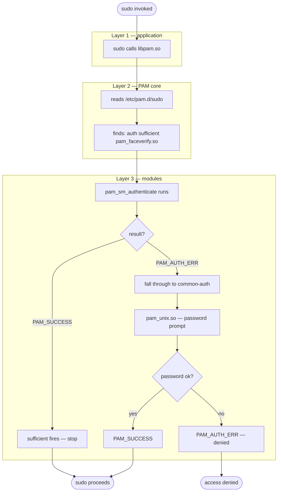

Part 1 of a short series: PAM module, integration, and API. Next: face-recognition pipeline.

I'm a software engineer and have used Linux on my personal and work machines for years. I'm a bit obsessed with security and prefer strong passwords, but typing `sudo` passwords repeatedly is tedious. My laptop's webcam also exposes an IR stream useful for liveness checks, so I decided to prototype authorizing `sudo` with a local face-verification flow. There are few off-the-shelf solutions (Howdy, Biopass), but I enjoy learning and building—so I implemented a solution that:
- Uses deep learning,
 - Uses deep learning
 - Combines classic vision-based approaches
 - Checks liveness using an IR feed
 - Ensembles signals to decide whether the face is enrolled

In this article I explain how Linux can support this use case — it is not a trivial problem and requires careful attention for face recognition and identification. I didn't train any deep models; instead I used a YOLO-based face detector. Let's start with the system side of the problem.

# Pluggable Authentication Modules
>PAM is a system of libraries that handle authentication tasks for applications (services) on the system. The library provides a stable interface (API) that privilege-granting programs defer to in order to perform standard authentication tasks[^1]. 

Linux uses PAM (pluggable authentication modules) as a layer that communicates between user and application during the authentication process[^2]. PAM separates the tasks of authentication from applications. PAM are available in the system and can be used by any application. 

Application developer would have to write the authentication checks for each new method without PAM. A call to PAM libraries leaves the checks to authentication experts and makes the application developer life easier.

PAM authentication consists of three layers[^3]:
- Top layers: PAM aware applications/services like `gdm`, `sshd`, `sudo`, `login`, `su` and etc. They just call libpam.so and say "authenticate this user." The actual logic is entirely someone else's problem.
- Middle layer: PAM core is the broker. It reads the per-service config file in /etc/pam.d/ (e.g. /etc/pam.d/sudo), figures out which modules to call and in what order, and applies the stacking rules (required, sufficient, optional, etc.). This is where policy lives — completely separate from both the application and the authentication backend.
- Bottom layer: PAM modules are the authentication experts. Each one knows exactly one thing: how to check a Unix password, how to talk to a fingerprint daemon, how to do a Kerberos ticket exchange. They don't know or care which application triggered them.


Each configuration file (Layer-2) for PAM-aware applications contains a group of directives that define the module and any controls or arguments with it[^4],[^5]. 

The format of each rule is a space separated collection of tokens:

> service type control module-path module-arguments

The syntax of files contained in the /etc/pam.d/ directory, are identical except for the absence of any service field. In this case, the service is the name of the file in the `/etc/pam.d/`  directory. This filename must be in lower case.

## Type
- `account`: performs non-authentication based account management. It is typically used to restrict/permit access to a service based on the time of day, currently available system resources (maximum number of users) or perhaps the location of the applicant user -- 'root' login only on the console.
- `auth`: provides two aspects of authenticating the user: 
    - Establishes that the user is who they claim to be, by instructing the application to prompt the user for a password or other means of identification. 
    - Grant group membership or other privileges through its credential granting properties.
- `password`: is required for updating the authentication token associated with the user. Typically, there is one module each 'challenge/response' based authentication (auth) type.
- `session`: associated with doing things that need to be done for the user before/after they can be given service. Such things include the logging of information concerning the opening/closing of some data exchange with a user, mounting directories, etc.

## Control
- `required`: failure of such a PAM will ultimately lead to the PAM-API returning failure but only after the remaining stacked modules (for this service and type) have been invoked.
- `requisite` like required, however, in the case that such a module returns a failure, control is directly returned to the application or to the superior PAM stack. 
- `sufficient`: if such a module succeeds and no prior required module has failed the PAM framework returns success to the application or to the superior PAM stack immediately without calling any further modules in the stack. 
- `optional`: the success or failure of this module is only important if it is the only module in the stack associated with this service+type.
- `include`: include all lines of given type from the configuration file specified as an argument to this control.
- `substack`: include all lines of given type from the configuration file specified as an argument to this control. 

For the more complicated syntax valid control values check [^5].

## Module Path
`module-path` (shared object) is either the full filename of the PAM to be used by the application (it begins with a '/'), or a relative pathname from the default module location: `/lib/security/` or `/lib64/security/`, depending on the architecture.

## Module Arguments
`module-arguments` are a space separated list of tokens that can be used to modify the specific behavior of the given PAM. Such arguments will be documented for each individual module.

## Sample configuration file
Let's now inspect a sample configuration file:
```bash
➜  ~ cat /etc/pam.d/sudo
#%PAM-1.0 #(1)

# Set up user limits from /etc/security/limits.conf.
session    required   pam_limits.so #(2)

session    required   pam_env.so readenv=1 user_readenv=0 #(3)
session    required   pam_env.so readenv=1 envfile=/etc/default/locale user_readenv=0 #(4)

@include common-auth #(5)
@include common-account #(6)
@include common-session-noninteractive #(7)
session    optional    pam_xauth.so #(8)
```
1. A magic comment that tells the PAM library this file follows the PAM 1.0 config syntax. Not functional, but required by convention.
2. Enforces the resource limits defined in `/etc/security/limits.conf` (max open files, max processes, CPU time, etc.) for the sudo session. required means it must succeed — if it fails, the whole stack fails.
3. Loads environment variables from `/etc/environment` (the system-wide env file). `readenv=1` enables reading it; `user_readenv=0` means it does not read the user's `~/.pam_environment`. This sets things like PATH, LANG, etc. for the elevated session.
4. Same module, second pass — but this time reads specifically from `/etc/default/locale`. This is a Debian/Ubuntu convention for storing locale variables (LANG, LC_ALL, LC_MESSAGES). Running `pam_env.so` twice is intentional: one call for general env, one for locale.
5. Pulls in `/etc/pam.d/common-auth` verbatim. On Debian/Ubuntu this is where the actual authentication logic lives — typically `pam_unix.so` for password checking, and where you'd insert Howdy or Biopass for face recognition (in this article's context replace it with the shared object that handles the face recognition). The `@include` keeps individual service configs DRY.
6. Pulls in `/etc/pam.d/common-account`. Handles account validation after auth succeeds — checking whether the account is expired, locked, or restricted by time of day (`pam_unix.so` account type, `pam_time.so`, etc.). Auth can succeed but account checks can still deny access.
7. Pulls in `/etc/pam.d/common-session-noninteractive`. Runs session setup modules that are safe for non-interactive use (no terminal required). Things like `pam_umask.so` for setting the file creation mask. Notably this is the non-interactive variant — `sudo` doesn't open a login shell so it skips things like MOTD printing.
8. Transfers the user's X11 authentication cookie (`.Xauthority`) into the elevated session so GUI applications launched via `sudo` can connect to the display. `optional` means if this fails (e.g. you're on a headless server with no X),` sudo` still works fine — it's non-fatal.

My plan is to first try to authenticate via my custom shared object; in case of failure or unavailability, fall back to `pam_unix.so` via `common-auth`:

> **Before you proceed:** if you are following along and have already modified `/etc/pam.d/sudo`, keep a root shell open in a separate terminal at all times while working through the next part. A bug in `pam_sm_authenticate` will cause `PAM_AUTH_ERR` on every call, which means `sudo` will fall back to the password prompt — but a crash or a missing `.so` file can behave less gracefully depending on your distribution. The safety net costs nothing and has saved this author more than once.

```
#%PAM-1.0

# Set up user limits from /etc/security/limits.conf.
session    required     pam_limits.so

session    required     pam_env.so readenv=1 user_readenv=0
session    required     pam_env.so readenv=1 envfile=/etc/default/locale user_readenv=0

auth       sufficient   pam_faceverify.so #This will be my shared object
@include common-auth
@include common-account
@include common-session-noninteractive
session    optional     pam_xauth.so
```

## PAM API

The module has to implement two function. The first one is `pam_sm_authenticate` function. The `pam_sm_authenticate` function is the service module's implementation of the `pam_authenticate` interface. The user is required to provide an authentication token depending upon the authentication service, usually this is a password, but could also be a finger print in this tutorial context face verification [^6].

```c
#include <security/pam_modules.h>

int pam_sm_authenticate(pam_handle_t *pamh, int flags, int argc,
                        const char **argv);
```

Return values:
- `PAM_AUTH_ERR`: Authentication failure.
- `PAM_CRED_INSUFFICIENT`: For some reason the application does not have sufficient            credentials to authenticate the user.
- `PAM_AUTHINFO_UNAVAIL`: The modules were not able to access the authentication            information. This might be due to a network or hardware failure etc.
- `PAM_SUCCESS`: The authentication token was successfully updated.
- `PAM_USER_UNKNOWN`: The supplied username is not known to the authentication            service.
- `PAM_MAXTRIES`: One or more of the authentication modules has reached its            limit of tries authenticating the user. Do not try again.

The second is `pam_sm_setcred`. The function required by the PAM spec even if unused. 
The `pam_sm_setcred function` is the service module's implementation of the `pam_setcred` interface. This function performs the task of altering the credentials of the user with respect to the corresponding authorization scheme [^6].

```c
#include <security/pam_modules.h>

int pam_sm_setcred(pam_handle_t *pamh, int flags, int argc,
                   const char **argv);
```

Return values:
- `PAM_CRED_UNAVAIL`: This module cannot retrieve the user's credentials.
- `PAM_CRED_EXPIRED`: The user's credentials have expired.
- `PAM_CRED_ERR`: This module was unable to set the credentials of the user.
- `PAM_SUCCESS`: The user credential was successfully set.
- `PAM_USER_UNKNOWN`: The user is not known to this authentication module.

These, non-PAM_SUCCESS, return values will typically lead to the credential stack failing. The first such error will dominate in the return value of `pam_setcred()`.

Now let's have a look at a concrete example of these two functions:
```cpp 
#define PAM_SM_AUTH
#include <security/pam_ext.h>
#include <security/pam_modules.h>

PAM_EXTERN int pam_sm_authenticate(pam_handle_t *pamh, int /*flags*/,
                                   int argc, const char **argv) {
  try {
    // 1. load enrolled faces from disk
    // 2. capture frames from camera
    // 3. detect, align, and verify face
    // 4. check liveness

    if (face_matches)
      return PAM_SUCCESS;   // grant access
    else
      return PAM_AUTH_ERR;  // deny — PAM falls through to next module

  } catch (const std::exception &e) {
    pam_syslog(pamh, LOG_ERR, "face_verify: %s", e.what());
    return PAM_AUTH_ERR;
  }
}

PAM_EXTERN int pam_sm_setcred(pam_handle_t *, int, int, const char **) {
  return PAM_SUCCESS;  // required by PAM spec, nothing to do here
}
```

The module returns: 
- `PAM_SUCCESS`: in case face accepted
- `PAM_AUTH_ERR`: all failure paths (no enrolled faces, camera failure, no frames, no face detected, liveness failure, score below threshold, exception)

Notice the module never returns `PAM_IGNORE`. This means every failure path is a hard authentication failure, which is the right behaviour when combined with `sufficient` in the PAM config. PAM will fall through to `common-auth` only on `PAM_AUTH_ERR`, not silently.

---

That covers the system side of the problem. The PAM layer gives us a clean hook — `pam_sm_authenticate` — where we can plug in authentication logic without touching the applications that use it. To summarise what we've done on this side:

- Understood the three-layer PAM architecture: applications delegate to PAM core, PAM core delegates to modules.
- Inspected a real `/etc/pam.d/sudo` configuration and understood what each directive does.
- Placed our custom module in the stack with `sufficient` so that a successful face verification grants access immediately, and a failure falls through gracefully to the standard password prompt via `common-auth`.
- Implemented the two entry points the PAM spec requires: `pam_sm_authenticate` for the actual authentication decision, and `pam_sm_setcred` as a no-op stub that satisfies the ABI contract.

The PAM side is intentionally thin — it knows nothing about cameras, embeddings, or liveness. Its only job is to return `PAM_SUCCESS` or `PAM_AUTH_ERR`. Everything interesting happens behind those four lines of pseudocode we left as comments:

```cpp
// 1. load enrolled faces from disk
// 2. capture frames from camera
// 3. detect, align, and verify face
// 4. check liveness
```

In the next part, we will fill those in. We will cover:

- **Face database** — how enrolled faces are stored and loaded from disk at authentication time.
- **Dual capture** — reading synchronized RGB and IR frames from the webcam.
- **Detection and alignment** — using a YuNet-based ONNX model to locate and crop faces to a canonical 112×112 patch.
- **Recognition** — extracting embeddings with a MobileNet-based deep model, and computing classical LBP histograms as a complementary signal.
- **Liveness** — using the IR feed and inter-frame motion to reject photo spoofing attempts.
- **Ensemble** — fusing the deep and classical scores into a single acceptance decision.

---

> **Before you proceed:** if you are following along and have already modified `/etc/pam.d/sudo`, keep a root shell open in a separate terminal at all times while working through the next part. A bug in `pam_sm_authenticate` will cause `PAM_AUTH_ERR` on every call, which means `sudo` will fall back to the password prompt — but a crash or a missing `.so` file can behave less gracefully depending on your distribution. The safety net costs nothing and has saved this author more than once.


# References:
[^1]: https://man7.org/linux/man-pages/man3/pam.3.html
[^2]: https://documentation.suse.com/de-de/sle-micro/5.3/html/SLE-Micro-all/cha-pam.html
[^3]: https://www.redhat.com/en/blog/pluggable-authentication-modules-pam
[^4]: https://docs.redhat.com/en/documentation/red_hat_enterprise_linux/6/html/managing_smart_cards/pam_configuration_files 
[^5]: https://man7.org/linux/man-pages/man5/pam.conf.5.html
[^6]: https://github.com/linux-pam/linux-pam


